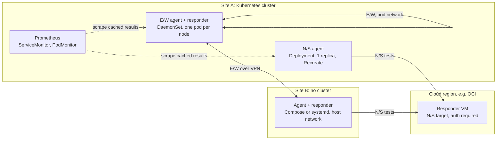

# Schedule bandwidth tests, cache results, answer siblings

> **Decisions since this report (2026-10-01, version 0.2).** Two recommendations changed after review.
> Latency is measured only as part of a throughput test (idle before the load, and under load): continuous
> latency probing between tests, and the budget's `latency_only` fallback, are dropped, because
> blackbox_exporter already does that job. An exhausted budget now skips runs. And a `business_hours`
> setting keeps throughput tests out of chosen hours: random gaps count only the time outside them.

Design research for [calebsargeant/bandwidth-exporter](https://github.com/calebsargeant/bandwidth-exporter). Facts, versions and prices are as of 2026-09-26. Status: proposed, for review. The benchmark harness this document cites is committed next to it under [bench/](bench/run_all.sh), with every result table in [bench/results/summary_tables.md](bench/results/summary_tables.md).

## Executive summary

**bandwidth-exporter should be one long-running Python 3.11+ process per test point that runs throughput tests on its own randomised schedule through a single global queue, and serves the last results from a cache on `/metrics`, so that a Prometheus scrape never starts a test.** Every instance is an agent and, optionally, a responder: a sibling authenticates over an HTTPS control API, asks for a test slot, and then receives either the exporter's built-in raw-TCP stream or a single-use iperf3 server spawned for that one test. North/south tests default to a self-hosted responder that the operator runs in a cloud region, which is the same component used for east/west, because every public backend brings terms, rate limits or public data release that an Apache-2.0 exporter used commercially should not switch on silently ([Ookla CLI 1.2.0 manual](https://install.speedtest.net/app/cli/ookla-speedtest-1.2.0-linux-x86_64.tgz), [M-Lab AUP](https://www.measurementlab.net/aup/)). A Python-native Cloudflare backend is the zero-setup quick start, and M-Lab NDT7 and a bring-your-own Ookla binary are opt-in plugins with warnings. The gap is real: dozens of speed-test exporters exist, but they are north/south only and often run the test inside the scrape, while the iperf3 exporters are `/probe` tools that need separately run servers and do no peer discovery or coordination ([edgard/iperf3_exporter](https://github.com/edgard/iperf3_exporter)). Tests are expensive: **1 Gbit/s for 10 s in each direction moves 2.5 GB, so an hourly symmetric test moves 1.8 TB a month**, which is why a data budget, a default of about six tests a day, sparse east/west topologies and receiver-side measurement with the warm-up excluded are part of the design rather than tuning knobs. Benchmarks in this repository show that **Python is not the bottleneck for raw TCP (14.7 Gbit/s on one stream, level with iperf3 3.21 at 13.7 Gbit/s) but its HTTP and TLS client stacks are (httpx 4.4 Gbit/s, aiohttp over TLS 4.7 Gbit/s per core)**, so the data plane runs outside the web event loop and 10 Gbit/s-class tests delegate to iperf3 ([bench/results/summary_tables.md](bench/results/summary_tables.md)).

The decisions, in one table:

| Decision | Recommendation | Main reason |
|---|---|---|
| Execution model | In-process scheduler, results cached in an immutable snapshot, custom collector on `/metrics`, optional authenticated trigger, optional one-shot textfile mode | Scrapes stay free of side effects, HA Prometheus pairs do not double tests, no `scrape_timeout` coupling |
| Scheduler | A small asyncio scheduler: one queue, one worker, `cronsim` for cron expressions, truncated-exponential random schedules by default | Mutual exclusion across north/south, east/west and on-demand runs; APScheduler's `max_instances` is per job, not global |
| North/south default | A self-hosted responder (bandwidth-exporter in responder role, or iperf3) on a cloud VM, ideally OCI | No third-party terms or data release, known capacity, 10 TB of free monthly egress on OCI |
| Public backends | Cloudflare (quick start, explicit opt-in), M-Lab NDT7 (opt-in, at most 4 tests a day), Ookla (user-supplied binary, explicit licence acknowledgement) | Licensing, terms of use, rate limits and privacy |
| East/west | Built-in responder with an HMAC or mTLS control API and slot admission; engines are built-in TCP, per-test iperf3, HTTP, and later OB-UDPST | iperf3 serves one test at a time and has unreleased CVE fixes; HTTP crosses proxies |
| Metric schema | Base units (bytes, seconds, ratios), gauges for the last result, labels `test` and `kind` (plus `peer` for east/west), context in an info metric | Prometheus naming rules and bounded cardinality |
| Data plane | Python control plane; built-in raw-TCP engine in a worker process, comfortable up to about 5 Gbit/s and viable to about 10; iperf3 3.21 or later for 10 Gbit/s-class, multi-stream and UDP tests | Benchmark results and CPU cost per Gbit/s |
| Kubernetes | Deployment with one replica and `Recreate` for north/south; DaemonSet or per-site Deployment for east/west; CPU request but no CPU limit; no service-account token by default | One tester per egress; CFS throttling silently caps throughput |

The research tracks behind this report disagreed in eight places. Each choice below is argued in the section named.

| Disagreement | Choice | Main reason | Section |
|---|---|---|---|
| Bytes (Prometheus rule) or bits (the dominant Grafana dashboard) | Bytes and seconds in the exporter; optional recording rules for dashboard 13665 | One base-unit rule; the conversion lives outside the exporter | Existing exporters |
| APScheduler 3.11 or a small asyncio queue | Small asyncio scheduler with `cronsim`; APScheduler 3.11 plus a global lock as the fallback | Global mutual exclusion and random triggers | Scheduling |
| Self-hosted responder or Cloudflare as the N/S default | No N/S test until a target is named; self-hosted for production; Cloudflare as the opt-in quick start | Third-party terms and repeatability | North/south |
| Cron with jitter or random (Poisson) start times | Truncated-exponential by default; cron available | RFC 2330 and M-Lab practice | Scheduling |
| Kubernetes Leases for every shared uplink, or no API access | Leases opt-in only; the default needs no API access | The house no-token rule | Scheduling |
| One outcome counter with a `result` label, or separate counters | `bandwidth_tests_total` and `bandwidth_test_failures_total` | Prometheus naming guidance | Metric schema |
| Ten context labels on every result, or minimal labels | `test`, `kind` and `peer`; context in `bandwidth_test_info` | Cardinality | Metric schema |
| Whether the house charts set a CPU limit (assumed yes) | They do not (Ponvara sets only a memory limit); keep that and make it a documented rule | CFS throttling caps results | Deployment |

## Terminology: north/south leaves the site, east/west stays between siblings

The two terms come from data-centre traffic diagrams, and this document uses them in that sense. **North/south (N/S)** is a test from a site or Kubernetes cluster across its WAN edge to an endpoint on the Internet: a public speed-test service, or a responder the operator runs in a cloud region. It answers "what does this site's Internet uplink deliver right now". **East/west (E/W)** is a test between sibling endpoints that the operator controls: node to node inside a cluster, cluster to cluster, or site to site over a VPN, WireGuard or Tailscale tunnel, or a private interconnect. It answers "what does the fabric or inter-site path between these two places deliver".

Several more terms recur. An **agent** is the process that schedules and initiates tests. A **responder** is the process that answers them; one bandwidth-exporter process can play both roles. A **test** is a named, configured measurement (for example `oci-fra` or the peer set `cluster-mesh`), and a **run** is one execution of it. **Download** always means data flowing towards the agent and **upload** means data flowing away from it, so in an E/W test "download" is peer to agent. An **engine** or **backend** is the data-plane implementation a test uses: the built-in TCP engine, iperf3, the Cloudflare HTTP method, NDT7, OB-UDPST and so on.

## Requirements the design has to satisfy

The requirements below come from the user's request, the Prometheus exporter guidelines and the house conventions of the sibling services. Later sections refer to them by number.

| ID | Requirement | Why it matters |
|---|---|---|
| R1 | Run N/S tests from a site or cluster to the Internet on a schedule | The user's primary use case |
| R2 | Run E/W tests to a sibling instance or responder on another node, cluster or site | The user's second use case |
| R3 | A scrape must never start a test | A test lasts 10 to 30 s and moves gigabytes; the default scrape timeout is 10 s ([Prometheus: Writing exporters](https://prometheus.io/docs/instrumenting/writing_exporters/#scheduling)) |
| R4 | At most one throughput test at a time per host, and per shared bottleneck where one exists | Overlapping tests split the link and corrupt each other's results |
| R5 | Bound the data each test and each month consumes | ISP caps and cloud egress fees |
| R6 | Safe defaults for commercial use: no third-party service is used without explicit opt-in | Ookla, M-Lab and fast.com terms (see the N/S section) |
| R7 | Follow Prometheus conventions: base units, bounded labels, freshness timestamps | Dashboards, alerts and TSDB health |
| R8 | Fit the house stack: Python 3.11+, uv, Ruff, pytest, type hints, pydantic-settings, FastAPI and uvicorn, prometheus-client, hardened Helm chart, GHCR, Flux | Consistency with Ponvara and Draventis |
| R9 | A responder must not become an open bandwidth sink or an attack surface | iperf3 CVE history; egress cost |
| R10 | Run in Kubernetes and outside it (Docker Compose, systemd, next to routers) | Sites without clusters |
| R11 | Produce comparable numbers over time | Server choice, tool version, MTU and congestion control shift results by 10% or more |
| R12 | Publish multi-arch images (amd64 and arm64) | Edge sites run small arm64 hosts, and broken arm images are a recurring complaint ([danopstech issues](https://github.com/danopstech/speedtest_exporter/issues)) |

## North/south: default to a self-hosted responder, offer Cloudflare as the quick start

### Four families of backend, and only a few are both maintained and headless

The north/south candidates fall into four families. The first uses the Ookla Speedtest.net server network. **The official Ookla CLI is frozen at 1.2.0 (2022-07-27)**, closed source, and machine-readable ([Ookla CLI 1.2.0 manual](https://install.speedtest.net/app/cli/ookla-speedtest-1.2.0-linux-x86_64.tgz)). The unofficial Python client sivel/speedtest-cli **was archived on 2026-04-30** ([GitHub](https://github.com/sivel/speedtest-cli)), while the MIT-licensed Go library showwin/speedtest-go is active at v1.8.3 (2026-09-01) but carries long-running accuracy complaints, such as "Invalid upload speeds" with 60 comments ([#226](https://github.com/showwin/speedtest-go/issues/226)) and "Impossible upload results against server 47892" from July 2026 ([#262](https://github.com/showwin/speedtest-go/issues/262)). The second family is HTTP testers against a CDN or volunteer servers: Cloudflare's MIT library (v1.14.1, 2026-09-22), which is browser-oriented and calls `speed.cloudflare.com/__down` and `/__up` ([cloudflare/speedtest](https://github.com/cloudflare/speedtest)); the Rust CLI cfspeedtest (v2.2.2, MIT) ([GitHub](https://github.com/code-inflation/cfspeedtest)); LibreSpeed (CLI v1.0.14, server v6.3.0, both LGPL-3.0) ([librespeed-cli](https://github.com/librespeed/speedtest-cli), [server](https://github.com/librespeed/speedtest)); and fast.com, whose CLI drives headless Chromium through Puppeteer ([fast-cli](https://github.com/sindresorhus/fast-cli)). The third is **M-Lab NDT7**, a single-stream WebSocket-over-TLS test of at most 10 s per direction with an official Apache-2.0 Go client (v0.10.1, 2026-01-26) that even ships a periodic Prometheus exporter ([ndt7 protocol spec](https://github.com/m-lab/ndt-server/blob/main/spec/ndt7-protocol.md), [ndt7-client-go](https://github.com/m-lab/ndt7-client-go)). The fourth is tools best pointed at an endpoint you control: iperf3, and responsiveness (RPM) tools such as Cloudflare's `mach` 0.3.0 (BSD-3-Clause, tagged 2026-09-25), whose prebuilt binaries cover Linux x86_64 but not arm64 ([networkquality-rs](https://github.com/cloudflare/networkquality-rs)).

Accuracy limits are mostly structural, because almost no project publishes ceilings. Cloudflare's default sequence issues one request at a time, and its largest download is 250 MB, which lasts about 0.2 s at 10 Gbit/s. That is dominated by slow start and request overhead, so **size-capped HTTP methods should be expected to under-read above roughly 1 to 2.5 Gbit/s** (an inference from the published sequence, not a measurement). NDT7 is single-stream by design; in lab tests it reached 90% of capacity at 100 ms RTT and 83% at 200 ms, and under cross-traffic it reports roughly a fair share where Ookla's multi-connection client reports up to 90% of the link ([MacMillan et al.](https://arxiv.org/abs/2205.12376)). A self-hosted cloud responder has its own ceiling: AWS limits single flows to 5 Gbit/s outside a cluster placement group, and internet-gateway traffic to 5 Gbit/s for instances under 32 vCPUs ([AWS](https://docs.aws.amazon.com/AWSEC2/latest/UserGuide/ec2-instance-network-bandwidth.html)), while GCP VMs without Tier_1 networking are limited to 7 Gbit/s to external addresses ([GCP](https://docs.cloud.google.com/compute/docs/network-bandwidth)). Validating a 10 Gbit/s uplink therefore needs iperf3 with parallel streams against a deliberately large responder.

### Licensing and terms decide the defaults, and need the owner's own legal check

This subsection summarises what the sources say. **It is not legal advice, and the owner should have these terms reviewed before any backend ships enabled by default or any third-party binary is bundled into the image.** Several of the primary texts could not be read from the research sandbox, which the table marks.

The Ookla CLI prints a licence notice that reads: "You may only use this Speedtest software and information generated from it for personal, non-commercial use, through a command line interface on a personal computer" ([Ookla CLI 1.2.0 manual](https://install.speedtest.net/app/cli/ookla-speedtest-1.2.0-linux-x86_64.tgz)). The binary accepts undocumented `--accept-license` and `--accept-gdpr` flags, and M-Lab's own Murakami image pre-seeds a `LicenseAccepted` setting ([Murakami Dockerfile](https://github.com/m-lab/murakami/blob/main/Dockerfile)); that shows the pattern exists, not that Ookla permits it. The full EULA and terms pages returned HTTP 403 to the sandbox, so whether they explicitly forbid container redistribution or scheduled use is **unverified**. The unofficial clients (sivel, showwin) license their own code permissively but call Speedtest.net's server-list and configuration endpoints, and no licence from Ookla covering that was found, which is a terms-of-use risk for commercial users regardless of the code licence. **M-Lab** is explicit and conditional: automated clients "should not run more than 4 tests per day" at randomised times, "Integration developers with commercial applications need to contribute to the platform", informed consent is required before installation, and every test is published with the client IP address as public-domain data ([M-Lab AUP](https://www.measurementlab.net/aup/), [M-Lab develop](https://www.measurementlab.net/develop/), [M-Lab privacy policy](https://www.measurementlab.net/privacy/)). **fast.com** says it "is not designed or supported for 3rd party service certification or other enterprise usage" ([fast.com](https://fast.com/)). **Cloudflare** publishes a methodology page but no terms for programmatic use of `__down` and `__up`, and cfspeedtest added workarounds for IP-level rate limiting on large payloads in 2026 ([PR #285](https://github.com/code-inflation/cfspeedtest/pull/285)). LibreSpeed's public list of 22 volunteer servers carries no usage-policy fields ([servers.php](https://librespeed.org/backend-servers/servers.php)), and public iperf3 servers answer any second client with "the server is busy running a test" ([iperf_error.c](https://github.com/esnet/iperf/blob/master/src/iperf_error.c)). For code licences, GPL-2.0 goresponsiveness must only ever run as a separate process from Apache-2.0 code, and LGPL-3.0 librespeed-cli can ship in the image as a separate binary with its notices and a source offer; the GPLv2 and Apache-2.0 incompatibility is the FSF's documented position but was not re-verified for this report.

| Backend | Code licence, latest release | Terms for scheduled or commercial use | Data exposure | Status in bandwidth-exporter |
|---|---|---|---|---|
| Self-hosted responder (bandwidth-exporter responder, iperf3 3.21, ndt-server 0.25.3, LibreSpeed 6.3.0) | Apache-2.0 (this project), BSD, Apache-2.0, LGPL-3.0 | Operator-owned, none | Nothing leaves the operator | **Recommended production default** |
| Cloudflare `__down`/`__up`, native Python client | Reference library MIT, 1.14.1 (2026-09-22) | None published; IP-level rate limiting observed in 2026 | Ordinary HTTP request metadata only, if the result-upload step is skipped (inference) | **Quick start, explicit opt-in** |
| M-Lab NDT7 via the official Go client | Apache-2.0, 0.10.1 (2026-01-26) | At most 4 tests a day, randomised; informed consent; commercial users must contribute | Client IP published as public-domain data | **Opt-in plugin with acknowledgement** |
| LibreSpeed public servers via librespeed-cli | LGPL-3.0, 1.0.14 (2026-08-17) | No policy found | Telemetry is opt-in | Opt-in; better used as a self-hosted server |
| Cloudflare `mach` (RPM) | BSD-3-Clause, 0.3.0 (2026-09-25) | None published | Uploads AIM reports unless `--disable-aim-scores` | Opt-in responsiveness add-on |
| Ookla CLI | Proprietary, 1.2.0 (2022-07-27) | "personal, non-commercial use"; full EULA unread (403) | IP, device identifiers and location may be shared with ISPs and regulators ([Ookla notice via Plume](https://my.plume.com/us/legal?tabId=ookla&countryId=us)) | Opt-in, user-supplied binary only, never bundled |
| showwin/speedtest-go | MIT, 1.8.3 (2026-09-01) | Uses Speedtest.net infrastructure without an Ookla licence | Ookla sees the tests | Opt-in with a terms warning, low priority |
| sivel/speedtest-cli | Apache-2.0, 2.1.3 (2021), archived 2026-04-30 | Legacy endpoints | Ookla sees the tests | **Avoid** |
| fast.com clients | MIT (fast-cli 5.2.0) | "not designed or supported for ... enterprise usage" | IP and device identifiers to Netflix | **Avoid** |
| Public iperf3 servers | BSD tool, MIT list | No policy; one test at a time | Operators see your IP | **Avoid for scheduled use** |
| goresponsiveness, Apple networkQuality | GPL-2.0 (dormant since 2024-01-29), proprietary macOS tool | Unknown | Unknown | **Avoid** as scheduled backends |

### Decision: no silent third-party default, self-hosted for production

The research tracks disagreed on the default. One proposed a self-hosted responder as the default; another proposed Cloudflare as the zero-configuration default, because it needs no infrastructure, its reference code is MIT and it publishes no user data. **This design resolves the disagreement by not running any north/south test until the operator names a target.** The documented production pattern is a self-hosted responder, and the documented quick start is Cloudflare with an explicit `enabled: true`. Four reasons favour self-hosting for production. It avoids every third-party term above (R6). It gives a fixed, known-capacity server, which matters because server choice alone can shift results by about 10% ([MacMillan et al.](https://arxiv.org/abs/2205.12376)). The operator controls rate and cost. And it reuses the E/W responder, so there is one component to build, secure and operate. The cost is that a self-hosted test measures the path to one cloud region rather than "the Internet"; two targets in different networks, in the spirit of the FCC's on-net and off-net pair, and Cloudflare as a low-frequency second opinion address that. The Cloudflare quick start defaults to a mean interval of 6 hours, honours `Retry-After`, never performs the result upload that Cloudflare's reference library does, and documents its under-reading above about 1 Gbit/s. OCI is the cheapest place for the self-hosted responder: the first 10 TB of monthly egress is free, then $0.0085/GB in North America and Europe, with no charge inside a region ([OCI price list API](https://apexapps.oracle.com/pls/apex/cetools/api/v1/products/?currencyCode=USD), [OCI VCN pricing](https://www.oracle.com/cloud/networking/virtual-cloud-network/pricing/)).

Each opt-in plugin carries its own guard rails. The NDT7 plugin shells out to the official Go client, since no maintained Python NDT7 client exists on PyPI ([bench/results/pypi_snapshot.json](bench/results/pypi_snapshot.json)), and enforces the spec's scheduler: an exponential gap with a mean of 6 hours, clamped to between 36 minutes and 15 hours, never more than 4 tests a day, a distinct `client_name` such as `bandwidth-exporter/<version>`, and HTTP 204 from the Locate API treated as "skip", not "fail" ([ndt7 protocol spec](https://github.com/m-lab/ndt-server/blob/main/spec/ndt7-protocol.md)). It refuses to start unless the configuration acknowledges public data release. The Ookla plugin runs only a binary the operator installed, only after `accept_license: true` and `accept_gdpr: true` appear in configuration, and only after `speedtest --version` identifies "Speedtest by Ookla", the guard MiguelNdeCarvalho's exporter uses against the unrelated Python `speedtest` binary ([exporter.py](https://github.com/MiguelNdeCarvalho/speedtest-exporter/blob/main/src/exporter.py)). For multi-WAN sites, the Python-native clients bind a source address themselves and iperf3 has `-B` and `--bind-dev`; inside Kubernetes, reaching a specific WAN usually needs `hostNetwork` or a secondary interface, which is an inference that has not been tested.

## East/west: every instance is its own responder, and iperf3 is the high-fidelity engine

### iperf3 is the best raw engine but a poor always-on server

**iperf3 3.21 (2026-04-09) is the current release**, it has run one thread per `-P` stream since 3.16, and its JSON is the richest of any candidate: receiver-side sums, TCP retransmits, RTT and congestion window per stream, and UDP jitter and loss ([RELNOTES](https://github.com/esnet/iperf/blob/master/RELNOTES.md), [iperf_api.c](https://github.com/esnet/iperf/blob/master/src/iperf_api.c)). Three properties make it unsuitable as the always-on responder, though. A server **runs exactly one test at a time** and answers every other connection with a single ACCESS_DENIED byte, which the client reports as error 121 ([iperf_server_api.c](https://github.com/esnet/iperf/blob/master/src/iperf_server_api.c)). Its control connection and data connections all go to one port and must reach the same process, so a Service or load balancer that spreads connections across endpoints makes the client hang ([esnet/iperf #823](https://github.com/esnet/iperf/issues/823)). And its pre-authentication parser has a long CVE history: **the fix for CVE-2026-71217 (NVD, 2026-08-11, CVSS 7.5), which bounds oversized `parallel` and `len` values, is commit [494dd37](https://github.com/esnet/iperf/commit/494dd377eca4689672becdf06a85158557db1586) on `master`, made after the 3.21 tag, and no release contains it as of 2026-09-26** ([NVD](https://nvd.nist.gov/vuln/detail/CVE-2026-71217)). Ubuntu 24.04 ships iperf3 3.16, which predates `--json-stream` and the 3.18 and 3.19.1 security fixes ([ESnet news](https://software.es.net/iperf/news.html)). iperf3's RSA authentication only gates admission, does not protect the streams, and has had its own CVEs ([CVE-2025-54349](https://nvd.nist.gov/vuln/detail/CVE-2025-54349)).

The alternatives mostly fail on maintenance or output format. iperf2 is multi-threaded and has the best latency-under-load features, but it has **no JSON output** and its `--permit-key` now requires a "professional edition" server ([iperf2 man page](https://sourceforge.net/p/iperf2/code/ci/master/tree/man/iperf.1)). ethr has had no release since v1.0.0 in 2020 ([microsoft/ethr](https://github.com/microsoft/ethr)), qperf's last commit was in 2018 ([linux-rdma/qperf](https://github.com/linux-rdma/qperf)), and Flent is GPLv3 and orchestrates other tools rather than replacing them ([tohojo/flent](https://github.com/tohojo/flent)). The one strong newcomer is **OB-UDPST 9.1.0 (2026-09-18)**, the Broadband Forum's BSD-style implementation of RFC 9097 and RFC 9946. It measures maximum IP-layer capacity with an adaptive UDP rate search, one server instance supports "multiple simultaneous overlapping tests", a server-side `-B` bandwidth budget rejects tests it cannot accommodate, and since 9.0.0 it authenticates every control message with a key-derivation function; the default control port moved from 25000 to 24601 in that release ([OB-UDPST README](https://github.com/BroadbandForum/obudpst/blob/master/README.md), [CHANGELOG](https://github.com/BroadbandForum/obudpst/blob/master/CHANGELOG.md)). Its measurement is a different quantity from TCP goodput, which the metric schema keeps in a separate family.

### Continuous E/W throughput monitoring does not exist yet in Kubernetes

The Kubernetes mesh monitors measure only latency and reachability. goldpinger (v3.11.3) and kubenurse (v1.15.4) discover peers through the Kubernetes API and bound the N-squared load with rendezvous hashing and a sha256 neighbour ring of 10, and Gardener's network-problem-detector scales its period by the square root of the node count ([goldpinger](https://github.com/bloomberg/goldpinger), [kubenurse](https://github.com/postfinance/kubenurse#neighbourhood-filtering), [NWPD](https://github.com/gardener/network-problem-detector)). The throughput tools, kubernetes/perf-tests netperf, knb and `cilium connectivity perf`, are one-shot benchmarks that write CSV or JSON rather than Prometheus metrics ([perf-tests netperf](https://github.com/kubernetes/perf-tests/tree/master/network/benchmarks/netperf), [cilium-cli](https://github.com/cilium/cilium-cli)). perfSONAR is the only system that schedules throughput meshes continuously. Its pScheduler puts throughput tests in an "exclusive" class that may not overlap any other exclusive or normal run, and lets start times slip randomly, but it archives to OpenSearch rather than Prometheus ([schedule.sql](https://github.com/perfsonar/pscheduler/blob/master/pscheduler-server/pscheduler-server/database/schedule.sql), [perfSONAR Grafana cookbook](https://docs.perfsonar.net/grafana_cookbook.html)). bandwidth-exporter borrows discovery and subsetting from the first group and exclusive scheduling from perfSONAR.

### The responder design: authenticate on HTTPS, then hand out one slot at a time

Every bandwidth-exporter instance can enable a responder role, so no separate `iperf3 -s` deployment is needed, which is unlike every iperf3 exporter surveyed. The responder exposes a small authenticated control API on the FastAPI app: `POST /v1/slot` asks for admission and returns a slot with an engine, a port and a deadline; `GET /v1/download?bytes=` and `POST /v1/upload` implement the HTTP engine, following LibreSpeed's garbage-and-empty pattern of 1 MiB chunks with a per-request byte cap ([speedtest-go web.go](https://github.com/librespeed/speedtest-go/blob/master/web/web.go)); and `GET /v1/info` returns version and supported engines. Admission is a semaphore, one throughput slot at a time by default. A busy responder answers 429 or 503 with `Retry-After`, the agent backs off with full jitter, and the outcome is counted rather than silently depressing the measured rate. This mirrors iperf3's busy answer and OB-UDPST's admission control, without iperf3's opaque failure mode ([OB-UDPST README](https://github.com/BroadbandForum/obudpst/blob/master/README.md)).

Four engines sit behind a slot. The **built-in TCP engine** is the default: plain TCP with 1 MiB application reads and writes in a worker process, with socket buffer sizes left to kernel autotuning, which the benchmark section shows is as CPU-efficient as iperf3 at up to about 10 Gbit/s on one stream. The **iperf3 engine** is for 10 Gbit/s-class, multi-stream and UDP tests, and for interoperating with existing iperf3 servers on routers. The responder starts `iperf3 -s -1 -p <negotiated port>` only after granting a slot, with `--idle-timeout`, `--server-max-duration` and `--server-bitrate-limit` set, and kills it at the deadline. Single-use exposure behind an authenticated handshake is also how the design contains iperf3's unreleased CVE fix. The **HTTP engine** carries data where raw TCP cannot pass. The **OB-UDPST engine**, planned for a later phase, provides the standards-based IP-capacity metric. The agent parses iperf3's `end.sum_received` for throughput, because it is what the receiver measured, reads retransmits and RTT from the sender streams, and reads jitter and loss from `sum_received` for UDP ([iperf_api.c](https://github.com/esnet/iperf/blob/master/src/iperf_api.c)).

### Path decides the engine

| Path | Raw TCP or iperf3 | HTTP engine |
|---|---|---|
| Pod to pod or node to node in one cluster | Best fidelity; target pod IPs from a headless Service, never a multi-endpoint ClusterIP | Works |
| Cross-cluster or cross-site over WireGuard, Tailscale or a routed interconnect | Works; the agent dials the peer's tunnel address | Works |
| Agent behind NAT | Works, since all connections are client-initiated | Works |
| Through Ingress, Gateway API or a Cloudflare Tunnel public hostname | Impossible: "An Ingress does not expose arbitrary ports or protocols" ([Kubernetes Ingress](https://kubernetes.io/docs/concepts/services-networking/ingress/)) | Only option; chunk uploads to 100 MB or less on Cloudflare Free and Pro ([Workers limits](https://developers.cloudflare.com/workers/platform/limits/)) |
| Through a service-mesh sidecar | Works, but measures proxy and mTLS overhead | Same caveat |

Tunnels change the path itself, so the agent records context with each result. Tailscale relays through DERP when a direct connection fails and recommends peer relays when relayed performance is inadequate ([Tailscale DERP](https://tailscale.com/kb/1232/derp-servers)); a relayed result should carry that fact in the test's info metric rather than be compared with direct ones. Its interface MTU of 1280 is reported only by community sources ([tailscale #3836](https://github.com/tailscale/tailscale/issues/3836)) and is **unverified**, as is WireGuard's common 1420 default, so UDP tests should set datagram sizes explicitly from the measured path MTU. iperf3 3.19 and later can keep the control connection alive through NAT idle timeouts with `--cntl-ka` ([RELNOTES](https://github.com/esnet/iperf/blob/master/RELNOTES.md)).

## Existing exporters: plenty for north/south, none for both directions

### The ecosystem moved from test-on-scrape to cached results

A GitHub search for speed-test exporters returns dozens of projects ([GitHub search](https://github.com/search?q=speedtest+exporter&type=repositories)), but they are fragmented, mostly north/south only, and each uses its own metric names and units. The most widely used, **MiguelNdeCarvalho/speedtest-exporter, has about 1.88 million Docker pulls but no release since v3.5.4 (2023-06-28)**. It is a GPL-3.0 Python wrapper around the Ookla CLI that runs the test inside the `/metrics` handler, with an optional cache that defaults to off and no lock ([exporter.py](https://github.com/MiguelNdeCarvalho/speedtest-exporter/blob/main/src/exporter.py), [Docker Hub](https://hub.docker.com/r/miguelndecarvalho/speedtest-exporter/tags)). The table shows representative projects rather than all of them.

| Project | Backend | Execution model | Licence | State (2026-09-26) |
|---|---|---|---|---|
| [MiguelNdeCarvalho/speedtest-exporter](https://github.com/MiguelNdeCarvalho/speedtest-exporter) | Ookla CLI | Test inside the scrape; optional cache, off by default | GPL-3.0 | Dormant, widely deployed |
| [danopstech/speedtest_exporter](https://github.com/danopstech/speedtest_exporter) | speedtest-go | Test on scrape, one request in flight | GPL-3.0 | Unmaintained since 2021 |
| [caarlos0/speedtest-exporter](https://github.com/caarlos0/speedtest-exporter) | Ookla CLI | Scrape-triggered, 30 min cache, mutex | Apache-2.0 | Archived 2026-08-29 |
| [jeanralphaviles/prometheus_speedtest](https://github.com/jeanralphaviles/prometheus_speedtest) | sivel speedtest-cli (archived) | `/probe`, one test per request | Apache-2.0 | Lightly maintained on an archived library |
| [heathcliff26/speedtest-exporter](https://github.com/heathcliff26/speedtest-exporter) | speedtest-go or external CLI | Cached, persisted to disk, optional remote_write | Apache-2.0 | Active; the only one with its own chart |
| [nicklasfrahm-dev/prometheus-speedtest-exporter](https://github.com/nicklasfrahm-dev/prometheus-speedtest-exporter) | speedtest-go | Stale-while-revalidate cache | MIT | Active |
| [d0ugal/internet-perf-exporter](https://github.com/d0ugal/internet-perf-exporter) | speedtest-go and fast.com | Background schedule per backend | MIT | Active |
| [M-Lab ndt7-prometheus-exporter](https://github.com/m-lab/ndt7-client-go/blob/main/cmd/ndt7-prometheus-exporter/main.go) | NDT7 | Memoryless random ticker, mean 6 h | Apache-2.0 | Maintained |
| [alexjustesen/speedtest-tracker](https://github.com/alexjustesen/speedtest-tracker) | Ookla CLI | Application scheduler; `/prometheus` exposes the latest result | MIT | Active, 5,992 stars |
| [edgard/iperf3_exporter](https://github.com/edgard/iperf3_exporter) | iperf3 binary | `/probe` per scrape; needs a separate `iperf3 -s` | MIT per LICENSE (the README says Apache-2.0) | Maintained, 1.3.1 (2026-01-01) |
| [yuvaldekel/iperf3_exporter](https://github.com/yuvaldekel/iperf3_exporter) | iperf3 | Fork of edgard with per-target intervals and a cache | MIT | New, small |
| [rtmongold/linkprobe](https://github.com/rtmongold/linkprobe) | LibreSpeed and iperf3 | Daemon with `--interval`; one schema with a `backend` label | Apache-2.0 | Created 2026-08-15, 0 stars |

The same problems recur across the issue trackers. READMEs tell users to stretch `scrape_timeout` to a minute or more ([danopstech](https://github.com/danopstech/speedtest_exporter), [billimek](https://github.com/billimek/prometheus-speedtest-exporter)). Stalled test processes exhausted a web server's threads ([MiguelNdeCarvalho #83](https://github.com/MiguelNdeCarvalho/speedtest-exporter/issues/83)). **jeanralphaviles warns that "if you are running more than one replica of Prometheus, as each replica independently scrapes targets", each one runs its own speed test** ([README](https://github.com/jeanralphaviles/prometheus_speedtest)). Integrations warn about data use ([Telegraf internet_speed](https://github.com/influxdata/telegraf/blob/master/plugins/inputs/internet_speed/README.md), [Home Assistant](https://www.home-assistant.io/integrations/speedtestdotnet/)). Results are implausible on fast links ([speedtest-go #109](https://github.com/showwin/speedtest-go/issues/109), [speedtest-tracker #2367](https://github.com/alexjustesen/speedtest-tracker/issues/2367)). Label hygiene is poor: danopstech attaches a per-test UUID, the user's IP and ISP and coordinates to every series ([exporter.go](https://github.com/danopstech/speedtest_exporter/blob/main/internal/exporter/exporter.go)), and MiguelNdeCarvalho added then reverted ISP and server labels between v3.5.0 and v3.5.1 ([releases](https://github.com/MiguelNdeCarvalho/speedtest-exporter/releases)). MiguelNdeCarvalho also sets every gauge to 0 on failure, which puts false "0 bit/s" dips into averages. Over 2021 to 2026 the surviving projects converged on a background schedule with a cached result, and the newest ones start there. bandwidth-exporter starts from that end state.

### The gap this project fills

**No existing tool runs scheduled N/S tests and scheduled E/W tests with one metric schema, answers its own siblings as a responder, discovers peers, and coordinates when they test.** The closest is linkprobe, one month old, which covers LibreSpeed and iperf3 with one `linkprobe_*` schema but probes one server per process and has no responder, discovery, coordination, container image or Helm chart ([README](https://github.com/rtmongold/linkprobe)). Other ecosystems split the two directions into separate integrations: Zabbix has "App Speedtest LAN" and "App Speedtest WAN" templates ([Zabbix](https://www.zabbix.com/integrations/speedtest)), and Home Assistant has separate speedtestdotnet and iperf3 integrations. Telegraf has `internet_speed` but no iperf3 input, and the OpenTelemetry Collector has no speed-test receiver at all ([Telegraf inputs](https://github.com/influxdata/telegraf/tree/master/plugins/inputs), [otel-collector-contrib receivers](https://github.com/open-telemetry/opentelemetry-collector-contrib/tree/main/receiver)). The licences matter for reuse too: the GPL-3.0 and AGPL-3.0 projects cannot be copied into an Apache-2.0 codebase, so the Apache-2.0 and MIT projects (caarlos0, heathcliff26, edgard, linkprobe, M-Lab) are the safe design references.

### Grafana compatibility: one dashboard dominates, and it uses bits

**Dashboard 13665, built for MiguelNdeCarvalho's exporter, has 64,531 downloads, and every other Prometheus speed-test dashboard has fewer than 3,000** ([grafana.com 13665](https://grafana.com/grafana/dashboards/13665)). It queries `speedtest_download_bits_per_second`, `speedtest_upload_bits_per_second`, `speedtest_ping_latency_milliseconds`, `speedtest_jitter_latency_milliseconds`, `speedtest_server_id` and `speedtest_up`, all without labels. The remaining dashboards use at least five different unit conventions (bit/s, byte/s, Mbit/s, "bytes_second", ms and s), and grafana.com's search returns no dashboards at all for iperf, iperf3, NDT7 or LibreSpeed ([grafana.com API](https://grafana.com/api/dashboards?filter=iperf&orderBy=downloads&direction=desc)).

This is one of the points where the research tracks disagreed. Prometheus says "always use _bytes_, even where _bits_ appear more common" ([Prometheus naming](https://prometheus.io/docs/practices/naming/)) and OpenMetrics agrees ([OpenMetrics units](https://github.com/prometheus/OpenMetrics/blob/main/specification/OpenMetrics.md#units-and-base-units)), while the dominant dashboard speaks bits and milliseconds. **The decision is bytes and seconds in the exporter, with compatibility provided outside it.** The chart ships an optional `PrometheusRule` bundle that records the six 13665 names from one designated N/S test (multiplying by 8, and by 1000 for the millisecond series), so a user can import 13665 unchanged. The exporter also ships a first-party dashboard with an N/S panel and an E/W matrix by peer, which fills a visible hole. Emitting duplicate bit-based series from the exporter itself was rejected, because it doubles series, bakes a unit conversion into the exposition that Prometheus asks exporters to leave to graphing tools, and cannot represent more than one target in 13665's label-free shape anyway. The compatibility rules intentionally break the `level:metric:operations` naming convention, and should say so in their comments.

## Execution model: scrapes read a cache and never start a test

The Prometheus guide's default is that "all scrapes should be synchronous" and that exporters should not run their own timers, but it names two exceptions that fit this case exactly: a metric that takes more than a minute to retrieve "it is acceptable to cache", provided the HELP string says so, and instance-level batch jobs may "rely on in-memory state" ([Prometheus: Writing exporters](https://prometheus.io/docs/instrumenting/writing_exporters/#scheduling), [Pushes](https://prometheus.io/docs/instrumenting/writing_exporters/#pushes)). The widely used smokeping_prober is precedent for a prober that runs its own schedule and target list ([smokeping_prober](https://github.com/SuperQ/smokeping_prober)). Five execution models were compared.

| Criterion | (a) Scheduler and cache | (b) `/probe` per scrape | (c) CronJob and Pushgateway | (d) OTLP or remote-write push | (e) Hybrid, recommended |
|---|---|---|---|---|---|
| Who decides when tests run | Exporter | Prometheus `scrape_interval` | CronJob controller | Exporter | Exporter, plus an optional authenticated trigger |
| Two HA Prometheus replicas | No extra tests | Twice the tests, plus any ad-hoc scrape | No extra tests | No extra tests | No extra tests |
| Timeout coupling | None | `scrape_timeout` must exceed the test and cannot exceed `scrape_interval` | Job deadline | None | None |
| Series continuity | Continuous | With hourly scrapes, visible about 5 minutes in 60 | Continuous, but never forgotten | Gaps unless re-pushed | Continuous |
| Meaning of `up` | Exporter alive | A slow test becomes `up=0` | Lost | Lost | Exporter alive |
| E/W responder | Same process | Still needs a separate server | Still needs a long-running responder | Same process | Same process |

The `/probe` model fails here for three reasons that compound. Prometheus requires that `scrape_timeout` "cannot be greater than the scrape interval" ([Prometheus configuration](https://prometheus.io/docs/prometheus/latest/configuration/configuration/)); a series disappears 5 minutes after its last sample ([staleness](https://prometheus.io/docs/prometheus/latest/querying/basics/#staleness)); and every replica or ad-hoc scrape triggers another gigabyte-scale test. For example, **one direction at 500 Mbit/s for 25 s is about 1.56 GB, hourly tests make that 37.5 GB a day and about 1.1 TB per 30 days, and an HA pair of Prometheus servers doubles it to about 2.2 TB** without anyone changing the exporter. The CronJob and Pushgateway model is the documented anti-pattern for instance-level jobs: Prometheus says "the only valid use case for the Pushgateway is for capturing the outcome of a service-level batch job", and the Pushgateway "never forgets series pushed to it" ([When to use the Pushgateway](https://prometheus.io/docs/practices/pushing/)). CronJobs are also only "approximately once", so they can double-run a test ([Kubernetes CronJob](https://kubernetes.io/docs/concepts/workloads/controllers/cron-jobs/)). Push over OTLP or remote write is worth offering later, but only for sites that Prometheus cannot reach.

**The recommended hybrid** works like this. Scheduled jobs and on-demand requests both enqueue into one `asyncio.Queue` consumed by exactly one worker, and a job that is already queued or running is not enqueued again. The worker runs the data plane in a separate process and writes each result into an immutable snapshot, which is swapped atomically. A custom collector (`GaugeMetricFamily`, `InfoMetricFamily`) renders the snapshot, so concurrent scrapes never race, as the collector guidance requires ([Writing exporters: Collectors](https://prometheus.io/docs/instrumenting/writing_exporters/#collectors)). `/metrics` always returns 200, even when the last test failed; test outcome lives in its own gauge, following blackbox_exporter's `probe_success`, so `up` keeps meaning "the exporter is alive". The exporter sets no sample timestamps and instead exposes `*_timestamp_seconds` gauges. HELP text states the caching, for example: "Download throughput of the most recent successful test, in bytes per second. Cached: tests run on the exporter's own schedule, not per scrape." OpenMetrics says exposition "SHOULD NOT rely on cached values, to the extent it is able to bypass any such caching" ([OpenMetrics](https://github.com/prometheus/OpenMetrics/blob/main/specification/OpenMetrics.md#exposition-performance)); here nothing can be bypassed, because the cached value is the most recent state that exists, and the documentation should say so. Two optional modes complete the picture. A read-only `/probe?target=` view returns one test's cached result and never triggers a test, which keeps Prometheus Operator `Probe` resources usable. A `run --once --textfile <path>` command writes a `.prom` file atomically for node_exporter's textfile collector on hosts that cannot run a daemon, which is the batch pattern Prometheus recommends for machine-level jobs.

## Scheduling: one queue per host, random start times, admission at the responder

### Random start times are a measurement requirement, not a nicety

RFC 2330 prefers Poisson sampling because its arrivals "cannot be predicted", and it warns that periodic sampling can synchronise with periodic network behaviour and "is susceptible to manipulation" ([RFC 2330](https://www.rfc-editor.org/rfc/rfc2330.html)). M-Lab encodes the same idea for non-interactive clients: draw the gap from an exponential distribution with a mean of 6 hours, clamp it to between 36 minutes and 15 hours, and sleep ([ndt7 protocol spec](https://github.com/m-lab/ndt-server/blob/main/spec/ndt7-protocol.md)); Murakami uses an unbounded exponential gap with 4 tests a day by default ([murakami server.py](https://github.com/m-lab/murakami/blob/main/murakami/server.py)). The architecture track sketched cron schedules such as `7 * * * *` with jitter, while the methodology track argued for random schedules, so the design supports both and **defaults to a truncated-exponential schedule per test, seeded per instance**. The N/S default is a mean of 4 hours, or about 6 tests a day, clamped to between 1 and 12 hours. Cron with jitter remains available for operators who need tests inside a maintenance window, and it should avoid :00 and :30. Coverage of the evening peak, which the FCC defines as weekdays from 19:00 to 23:00 local time and samples hourly, is a later option: a pure Poisson process with a 6-hour mean averages only about 0.7 tests inside a 4-hour window per day ([FCC MBA Technical Appendix](https://data.fcc.gov/download/measuring-broadband-america/2021/Technical-Appendix-fixed-2021.pdf)).

### A small asyncio scheduler beats APScheduler for this job

This is another disagreement to resolve. Ponvara's design uses APScheduler with an in-process lock per source ([Ponvara design](https://docs.magmamoose.com/ponvara/DESIGN/)), and the benchmark track recommended pinning `apscheduler>=3.11,<4` and using its `CronTrigger` so that croniter is not needed. The architecture track recommended a small asyncio-native scheduler. **This report chooses the small scheduler**, roughly 150 lines tested with a fake clock, for three reasons. The core requirement is global mutual exclusion across N/S tests, E/W tests, responder slots and on-demand runs, and APScheduler's `max_instances` "is per job", so it would still need a hand-written global lock ([APScheduler 3.x user guide](https://apscheduler.readthedocs.io/en/3.x/userguide.html)). The default trigger is truncated-exponential, which APScheduler does not provide; its `jitter` is plus or minus a window for cron triggers and an added delay for interval triggers. And its asyncio scheduler has a known bug, "permanently stopping the processing of jobs if `_process_jobs()` raised an exception", whose fix is still unreleased in the 3.x changelog ([APScheduler version history](https://apscheduler.readthedocs.io/en/3.x/versionhistory.html)). APScheduler 3.11.3 (2026-06-28) is otherwise stable, and 3.11 with `max_instances=1`, `coalesce=True` and one global lock remains an acceptable fallback if the owner values parity with Ponvara more; **4.0 is still an alpha (4.0.0a6, 2025-04-27) whose README says "do NOT use this release in production!"** ([APScheduler README](https://github.com/agronholm/apscheduler/blob/master/README.rst)). For cron parsing, `cronsim` 2.7 is dependency-free and marked Production/Stable ([PyPI cronsim](https://pypi.org/project/cronsim/)). croniter was declared unmaintained in December 2024, revived under pallets-eco in March 2026 (6.2.4, 2026-07-10), and its unreleased 6.3.0 carries the warning "This changes existing schedules, silently and substantially" ([croniter CHANGELOG](https://github.com/pallets-eco/croniter/blob/main/CHANGELOG.rst)), so it should be avoided or pinned below 6.3.

Two more scheduler behaviours matter in production. **Catch-up at start-up** follows systemd's `Persistent=` idea: the exporter persists its last results to a state file and, on start, runs a test immediately only if the newest result is older than one interval. Otherwise every Flux reconcile or rollout would trigger a gigabyte-scale test, and series would have gaps after restarts. **A budget guard** in the queue estimates each run's cost from the last measured rate and skips the run, counting it as `reason="budget"`, when the remaining budget cannot cover it.

### Mutual exclusion inside a host and coordination between peers

Inside one process, the single worker already serialises everything, and the responder's slot semaphore shares the same lock, so a node is never a client and a server at the same time, which matches perfSONAR's per-host exclusive class. Across processes on one node, for example a north/south Deployment pod landing on a node that also runs an E/W DaemonSet pod, the simplest fix is to enable the N/S role inside the DaemonSet pod on one labelled node, so that one process and one lock cover both roles.

Between peers, randomisation alone is not enough. For N independent random schedulers with test duration d and mean interval T, the chance that a given test overlaps another is about 1 minus exp(-2d(N-1)/T):

| Nodes | Test duration | Mean interval | Chance a test overlaps another |
|---|---|---|---|
| 10 | 25 s | 1 hour | about 12% |
| 10 | 25 s | 15 minutes | about 39% |
| 20 | 25 s | 1 hour | about 23% |

The design therefore layers four cheap mechanisms. The responder semaphore is the mandatory baseline. Deterministic offsets start each (source, destination) pair at a hash of the pair and the time bucket, plus a small random slip in the spirit of pScheduler's `sliprand` ([pscheduler task](https://github.com/perfsonar/pscheduler/blob/master/pscheduler-core/pscheduler-core/task)). Sparse topologies bound the work: each agent tests k peers chosen by rendezvous hashing, as goldpinger does, or a ring, and when a full mesh is really wanted, a round-robin tournament runs N/2 disjoint pairs in each of N-1 rounds. Finally, paths that share a bottleneck, such as several pairs crossing one site VPN gateway, need a per-link-group lock. The methodology track proposed a Kubernetes `Lease` per site or uplink for this, but a Lease needs a service-account token and RBAC, which the house charts deliberately avoid. **Leases are therefore opt-in**, rendered only when a shared-bottleneck group spans several pods; the default single tester per egress plus responder admission needs no Kubernetes API access at all ([Kubernetes Leases](https://kubernetes.io/docs/concepts/architecture/leases/)).

## Data budgets: an hourly 1 Gbit/s test moves 1.8 TB a month

### Volume scales with line rate, cadence and direction count

A full-rate test moves rate times duration in each direction: **1.25 GB per 10 s at 1 Gbit/s, and 12.5 GB at 10 Gbit/s**. A 2 s warm-up adds about 20% on top. The table uses 10 s measured per direction, decimal units and a 30-day month; the arithmetic is this report's, from those inputs.

| Line rate | One direction, 10 s | Download plus upload | Every 15 min (96 a day) | Hourly (24 a day) | Default, about 6 a day |
|---|---|---|---|---|---|
| 100 Mbit/s | 0.125 GB | 0.25 GB | 0.72 TB a month | 0.18 TB a month | 45 GB a month |
| 1 Gbit/s | 1.25 GB | 2.5 GB | 7.2 TB a month | 1.8 TB a month | 450 GB a month |
| 10 Gbit/s | 12.5 GB | 25 GB | 72 TB a month | 18 TB a month | 4.5 TB a month |

Consumer caps make these numbers bite. Comcast's new national Xfinity plans "include Unlimited Data" ([Comcast, 2025-06-26](https://corporate.comcast.com/press/releases/comcast-new-national-xfinity-internet-packages-unlimited-data-advanced-wifi-gateway)), but the 1.2 TB cap reportedly survives on legacy plans, which is known only from secondary and forum sources and is **unverified** ([Xfinity forum](https://forums.xfinity.com/conversations/customer-service/plan-reverted-to-12tb-cap-in-january-2026/697d905118df6865294bba8c)). An hourly symmetric test on a 1 Gbit/s line (1.8 TB) would exceed such a cap on its own. The FCC's measurement programme treats this as a hard requirement: its system "Must not require an amount of data to be downloaded which may materially impact any data limits", and it moved a satellite ISP's panel to a "lighter weight test schedule" when data allowances applied ([FCC MBA Technical Appendix](https://data.fcc.gov/download/measuring-broadband-america/2021/Technical-Appendix-fixed-2021.pdf)).

### Cloud egress: the self-hosted responder pays for the download direction only

When the N/S target is a self-hosted cloud responder, the cloud side pays egress for the download stream, and the upload stream is ingress, which is free on all four providers reviewed. The table prices the download direction alone (10 s per test), assumes no other egress on the account, and uses list prices read on 2026-09-26 ([OCI price list API](https://apexapps.oracle.com/pls/apex/cetools/api/v1/products/?currencyCode=USD), [AWS price list](https://pricing.us-east-1.amazonaws.com/offers/v1.0/aws/AWSDataTransfer/current/us-east-1/index.json), [AWS EC2 pricing](https://aws.amazon.com/ec2/pricing/on-demand/), [GCP network pricing](https://cloud.google.com/vpc/network-pricing), [Azure bandwidth pricing](https://azure.microsoft.com/en-us/pricing/details/bandwidth/)).

| Line rate and cadence | Egress per month | OCI (NA/EU) | AWS | GCP Premium | GCP Standard | Azure |
|---|---|---|---|---|---|---|
| 1 Gbit/s, about 6 a day (default) | 225 GB | $0 | about $11 | about $25 | about $1 | about $11 |
| 100 Mbit/s, every 15 min | 360 GB | $0 | about $23 | about $40 | about $12 | about $23 |
| 1 Gbit/s, hourly | 900 GB | $0 | about $72 | about $100 | about $54 | about $70 |
| 1 Gbit/s, every 15 min | 3,600 GB | $0 | about $315 | about $379 | about $268 | about $305 |
| 10 Gbit/s, hourly | 9,000 GB | $0 | about $801 | about $932 | about $695 | about $774 |
| 10 Gbit/s, every 15 min | 36,000 GB | about $219 | about $3,103 | about $3,000 | about $2,367 | about $3,020 |

The inputs behind the table are: OCI charges nothing for the first 10,240 GB a month from North America, Europe and the UK and $0.0085/GB after that; AWS gives 100 GB a month free and then charges $0.09/GB for the first 10 TB; GCP Premium charges $0.12/GiB up to 1 TiB after the first GiB, while Standard gives 200 GiB free and then charges $0.085/GiB; and Azure gives 100 GB free and then charges $0.087/GB. Two points are **uncertain**. It is unclear whether OCI's free 10 TB applies per tenancy or per regional price part, and it may be shared with other workloads, so treat it as a budget, not a guarantee. And Azure's retail price API still lists an inter-zone meter at $0.01/GB that the pricing page does not mention.

East/west inside one cloud region costs money on most providers. AWS meters inter-AZ traffic at $0.01/GB "in/out/between" zones, so up to $0.02/GB in effect; GCP charges $0.01/GiB between zones; OCI charges nothing within a region, across availability domains included ([OCI VCN pricing](https://www.oracle.com/cloud/networking/virtual-cloud-network/pricing/)). An hourly symmetric 1 Gbit/s E/W test across zones (1.8 TB a month) therefore costs about $36 on AWS, about $17 on GCP and nothing on OCI. Meshes multiply this: **a full mesh of 5 sites at 1 Gbit/s, 10 s per direction, hourly, is 20 directed tests per round and 18 TB a month**, and over a VPN it also counts against each site's ISP allowance at both ends.

### Budgets are enforced in the exporter, and running out degrades gracefully

Production measurement systems bound data in five ways: fixed durations, since ndt7 and the FCC use 10 s; stability-based early stopping, where the responsiveness draft declares saturation once the standard deviation of the last four moving averages falls below 5% of the current average ([draft-ietf-ippm-responsiveness](https://datatracker.ietf.org/doc/html/draft-ietf-ippm-responsiveness)); byte caps, such as ndt7's `early_exit=250`; progressive sizing, as Cloudflare does; and a lighter schedule when an allowance applies. Byte caps and progressive sizing only save data at lower rates: a 250 MB cap lasts 2 s at 1 Gbit/s but 0.2 s at 10 Gbit/s, which is shorter than slow start on a 50 ms path, so it would badly under-report. bandwidth-exporter therefore uses a 10 s measured phase with stability-based early stop after at least 3 s and a hard cap at 15 s, and optional per-test byte caps that warn when the cap implies a measured phase under about 3 s. On top of that sit a global budget and optional per-test budgets, daily and per billing period with a configurable reset day, charged with actual bytes including warm-up, probes and failed tests. Before each run the queue estimates the cost from the last measured rate and skips the run if the remaining budget cannot cover it. When the budget is exhausted the exporter falls back to latency-only probing, as the FCC did for its capped panel. The budget state is persisted with the other results, so a restart does not reset it.

## Metric schema: base units, gauges for results, three instrumentation labels

### Names, types and units

The prefix is `bandwidth_`, the exporter name without `_exporter`, as the guide suggests ([Writing exporters: Naming](https://prometheus.io/docs/instrumenting/writing_exporters/#naming)); `bwexp_` is the collision-proof alternative and is listed as an open decision. Every unit is a base unit: bytes, seconds, and ratios from 0 to 1 ([Prometheus naming](https://prometheus.io/docs/practices/naming/)). Download and upload are separate metrics rather than a label, because "Read/write and send/receive are best as separate metrics" ([Writing exporters: Labels](https://prometheus.io/docs/instrumenting/writing_exporters/#labels)). The throughput gauge is not a "rate of a counter" computed by the exporter: it is the measured result of a discrete event, so exposing it does not break the rule that exposers should leave calculation to ingestors. The raw bytes and duration are exposed next to it so users can audit it, as iperf3_exporter's users already do.

| Metric | Type | Labels | Meaning |
|---|---|---|---|
| `bandwidth_download_bytes_per_second`, `bandwidth_upload_bytes_per_second` | gauge | `test`, `kind`, `peer` | Receiver-side goodput of the most recent successful run, warm-up excluded. HELP says the value is cached |
| `bandwidth_download_bytes`, `bandwidth_upload_bytes` | gauge | same | Payload bytes counted in that run's measured phase |
| `bandwidth_download_duration_seconds`, `bandwidth_upload_duration_seconds` | gauge | same | Length of the measured phase |
| `bandwidth_idle_latency_seconds` | gauge | same | Median RTT before load |
| `bandwidth_download_latency_seconds`, `bandwidth_upload_latency_seconds` | gauge | same | Median RTT while loaded, per direction (working latency) |
| `bandwidth_jitter_seconds`, `bandwidth_packet_loss_ratio` | gauge | same | Where the engine reports them |
| `bandwidth_download_retransmits`, `bandwidth_upload_retransmits` | gauge | same | TCP segments retransmitted in the run |
| `bandwidth_ip_capacity_download_bytes_per_second`, `bandwidth_ip_capacity_upload_bytes_per_second` | gauge | same | OB-UDPST maximum IP-layer capacity (RFC 9097), headers included; never mixed with goodput |
| `bandwidth_last_test_success` | gauge | same | 1 or 0, the analogue of blackbox's `probe_success` |
| `bandwidth_last_test_cpu_saturated` | gauge | same | 1 when the tester or responder used more than about 90% of its CPU budget during the run |
| `bandwidth_last_success_timestamp_seconds`, `bandwidth_last_attempt_timestamp_seconds`, `bandwidth_next_run_timestamp_seconds` | gauge | same | Unix time; initialised to 0 for every configured test |
| `bandwidth_plan_download_bytes_per_second`, `bandwidth_plan_upload_bytes_per_second` | gauge | same | Optional contracted rate from configuration, for alerts |
| `bandwidth_tests_total` | counter | same | Attempts |
| `bandwidth_test_failures_total` | counter | same, plus `reason` | `timeout`, `connect`, `auth`, `peer_busy`, `protocol`, `tool_error` |
| `bandwidth_tests_skipped_total` | counter | same, plus `reason` | `busy`, `budget`, `peer_unavailable`, `rate_limited`, `cross_traffic` |
| `bandwidth_sent_bytes_total`, `bandwidth_received_bytes_total` | counter | same | Every byte moved, including warm-up, probes and failed runs; the input to budget alerts |
| `bandwidth_test_info` | info (value 1) | same, plus `backend`, `method`, `target`, `streams`, `cca`, `network_mode`, `ip_family`, `tunnel`, `relayed` | Context that explains a number, kept off the result series |
| `bandwidth_public_ip_hash` | gauge | `test`, `kind` | North/south only. The value is a hash of the egress IP, following blackbox's `probe_ip_addr_hash`; no IP label |
| `bandwidth_test_in_progress`, `bandwidth_queue_length` | gauge | none | Scheduler health |
| `bandwidth_data_budget_bytes`, `bandwidth_budget_period_transferred_bytes` | gauge | none | Configured budget, and bytes charged in the current billing period (persisted; resets on the configured day) |
| `bandwidth_cpu_quota_cores` | gauge | none | Detected cgroup CPU quota, 0 when unlimited |
| `bandwidth_on_demand_requests_total` | counter | `result` | `accepted`, `conflict`, `rate_limited`, `unauthorised` |
| `bandwidth_responder_sessions_total`, `bandwidth_responder_rejected_sessions_total`, `bandwidth_responder_sent_bytes_total`, `bandwidth_responder_received_bytes_total`, `bandwidth_responder_busy` | counter and gauge | `reason` on rejections only | Responder load, abuse detection and responder-side budget |
| `bandwidth_build_info` | info | `version`, `revision`, `python_version`, `iperf3_version` | Build metadata |

### Label and cardinality rules

The unique key of a result series is `test`, a stable name from configuration, plus `peer` for east/west tests, where it is a stable node or site identity and never a pod name or an IP address, because pod names churn on every rollout. `kind` (`north_south` or `east_west`) is a deliberate non-unique label, because almost every query filters on it, which the guide allows when "virtually all users of a metric will want the additional information". `reason` and `result` are bounded enumerations. Everything else goes into `bandwidth_test_info` or nowhere: IP addresses, ISP names, per-run server choices, run identifiers and coordinates are exactly the labels that hurt danopstech's users. Site, cluster, node and region are target labels that Prometheus attaches through relabelling, not labels the exporter sets ([Writing exporters: Target labels](https://prometheus.io/docs/instrumenting/writing_exporters/#target-labels-not-static-scraped-labels)).

Two more disagreements are settled here. The E/W track suggested one counter with a `result` label; the Prometheus guidance says "Do not use one metric with a failed or success label", so the schema keeps `bandwidth_tests_total` and `bandwidth_test_failures_total` apart ([Writing exporters: Naming](https://prometheus.io/docs/instrumenting/writing_exporters/#naming)). The methodology track listed ten context labels for every result, including `method`, `streams`, `cca`, `network_mode`, `tunnel`, `ip_family` and `period`; they live in the info metric instead, joinable with `* on (test, kind, peer) group_left(...)`, and peak or off-peak is computed at query time from the result timestamp rather than stored, since it would split every series in two. A change to a comparability-relevant setting, such as the server, engine, stream count or congestion control, should come with a new test name, and the info metric records it either way. Servers that auto-select per run conflict with the rule that info values should not change during a process's lifetime, which is one more reason to pin servers in configuration.

Per-target results are gauges, not histograms. At a handful of results a day, `quantile_over_time` and `min_over_time` over days give per-target distributions; a classic histogram with a distinct name is optional, and only worth it for fleet-wide questions such as "what share of 200 sites tested below X". Each result key produces at least 20 series, more once failure and skip reasons appear, so north/south stays small, but a full east/west mesh grows with N(N-1) directed pairs: **10 nodes give 90 pairs and at least 1,800 series, 50 nodes give 2,450 pairs and at least 49,000 series, and 100 nodes give 9,900 pairs and at least 198,000 series**, far beyond the guidance to "investigate alternate solutions" once a metric's cardinality could exceed 100 ([Prometheus instrumentation](https://prometheus.io/docs/practices/instrumentation/#do-not-overuse-labels)). Test time and bytes grow the same way. The default east/west topology is therefore k = 3 random peers per agent, chosen by rendezvous hashing so pairings survive restarts; 50 nodes then produce 150 pairs and about 3,000 series, with a hard per-agent peer limit in configuration.

### Example recording and alerting rules

The schema supports the useful alerts without any threshold logic in the exporter. Staleness is `time()` minus the last-success timestamp. "Several consecutive runs below plan" is `max_over_time` over the window guarded by `changes()` on the success timestamp. Asymmetry is a ratio tested with `abs(log2(...))`. Budget burn is a `rate()` of the byte counters against the budget gauge. Batch-style alerts should allow for "at least enough time for 2 full runs" ([Prometheus: Alerting](https://prometheus.io/docs/practices/alerting/)), so the stale threshold below is two maximum gaps of the default schedule plus slack. These rules were written for this report and **have not been run against a live Prometheus**; they should pass `promtool test rules` before the chart ships them as an optional `PrometheusRule`.

```yaml
groups:
  - name: bandwidth-exporter.recording
    rules:
      # E/W symmetry as measured by one agent (1.0 means symmetric)
      - record: test:bandwidth_upload_per_download:ratio
        expr: |
          bandwidth_upload_bytes_per_second{kind="east_west"}
            / bandwidth_download_bytes_per_second{kind="east_west"}

  - name: bandwidth-exporter.alerts
    rules:
      - alert: BandwidthExporterDown
        expr: up{job="bandwidth-exporter"} == 0
        for: 10m

      # The scheduler missed its own plan by more than an hour
      - alert: BandwidthTestOverdue
        expr: |
          bandwidth_next_run_timestamp_seconds > 0
          and time() > bandwidth_next_run_timestamp_seconds + 3600
        for: 15m

      # No success for two maximum gaps (2 x 12 h) plus slack, ignoring young processes
      - alert: BandwidthTestStale
        expr: |
          (time() - bandwidth_last_success_timestamp_seconds) > 26 * 3600
          and on (instance, job)
          (time() - process_start_time_seconds) > 26 * 3600
        for: 30m

      # Every N/S result in the last day below 70% of plan, and at least three results in play
      - alert: BandwidthDownloadBelowPlan
        expr: |
          max_over_time(bandwidth_download_bytes_per_second{kind="north_south"}[24h])
            < 0.7 * bandwidth_plan_download_bytes_per_second{kind="north_south"}
          and
          changes(bandwidth_last_success_timestamp_seconds{kind="north_south"}[24h]) >= 2

      # E/W asymmetry beyond a factor of 2 in either direction
      - alert: BandwidthEastWestAsymmetric
        expr: abs(log2(test:bandwidth_upload_per_download:ratio)) > 1
        for: 6h

      - alert: BandwidthTestsFailing
        expr: |
          sum without (reason) (increase(bandwidth_test_failures_total[1d]))
            / increase(bandwidth_tests_total[1d])
          > 0.5
        for: 1h

      # A CPU cap, not the network, probably limited the last result
      - alert: BandwidthTestCpuBound
        expr: bandwidth_last_test_cpu_saturated == 1
        for: 1h
        labels: {severity: info}

      # Projected 30-day use at the last day's rate exceeds the budget
      - alert: BandwidthDataBudgetBurn
        expr: |
          sum without (test, kind, peer) (
            rate(bandwidth_sent_bytes_total[1d]) + rate(bandwidth_received_bytes_total[1d])
          ) * 30 * 86400
          > on (instance, job) bandwidth_data_budget_bytes
        for: 1h

      - alert: BandwidthDataBudgetNearlyExhausted
        expr: bandwidth_budget_period_transferred_bytes > 0.8 * bandwidth_data_budget_bytes

      - alert: BandwidthPublicIpChanged
        expr: changes(bandwidth_public_ip_hash[6h]) > 0
        labels: {severity: info}

  # Optional: lets grafana.com dashboard 13665 work unchanged. These names deliberately
  # break the level:metric:operations convention. speedtest_server_id has no equivalent.
  - name: bandwidth-exporter.compat-dashboard-13665
    rules:
      - record: speedtest_download_bits_per_second
        expr: 8 * bandwidth_download_bytes_per_second{test="oci-fra"}
      - record: speedtest_upload_bits_per_second
        expr: 8 * bandwidth_upload_bytes_per_second{test="oci-fra"}
      - record: speedtest_ping_latency_milliseconds
        expr: 1000 * bandwidth_idle_latency_seconds{test="oci-fra"}
      - record: speedtest_jitter_latency_milliseconds
        expr: 1000 * bandwidth_jitter_seconds{test="oci-fra"}
      - record: speedtest_up
        expr: bandwidth_last_test_success{test="oci-fra"}
```

## Example configuration file

Configuration follows both sibling services. Like Draventis, the test list is a YAML file that the Helm chart renders from values into a ConfigMap, and secrets reach the container only as environment variables, never in the file ([Draventis configuration](https://docs.magmamoose.com/draventis/configuration/)). Like Ponvara, the file is loaded through pydantic-settings, here via its `YamlConfigSettingsSource` (pydantic-settings 2.15.0), with environment variables for scalars and secret references ([PyPI pydantic-settings](https://pypi.org/project/pydantic-settings/)). YAML is also Prometheus's standard configuration format ([Writing exporters: Configuration](https://prometheus.io/docs/instrumenting/writing_exporters/#configuration)). Loading validates cron expressions, rejects unknown keys, and refuses plugins whose acknowledgements are missing. Rates in configuration accept human units such as `1Gbit/s`, while every metric stays in bytes.

```yaml
# /etc/bandwidth-exporter/config.yaml
listen: "0.0.0.0:8080"              # placeholder; claim a port on the Prometheus port-allocation wiki
state_dir: /var/lib/bandwidth-exporter   # last results and budget state (emptyDir or PVC)

trigger:                            # POST /api/v1/tests/{name}/run
  enabled: false                    # off by default, like Prometheus --web.enable-lifecycle
  token_env: BWEXP_TRIGGER_TOKEN
  min_interval: 15m                 # per test; extra requests get 429 with Retry-After

budget:
  limit: 500GB                      # per billing period, all tests and directions
  reset_day: 1
  on_exhausted: latency_only        # fall back to latency and loss probes

defaults:
  schedule: {random: {mean: 4h, min: 1h, max: 12h}}   # truncated exponential
  warmup: auto                      # stability rule, else max(2 s, 10 x RTT) capped at 5 s
  duration: 10s                     # measured phase per direction
  max_duration: 15s
  streams: 4
  directions: [download, upload]    # always run one after the other

north_south:
  - name: oci-fra                   # production pattern: our own responder in a cloud region
    engine: builtin
    target: https://bwexp-fra.example.net:8443
    auth: {hmac_key_env: BWEXP_PEER_KEY}
    plan: {download: 1Gbit/s, upload: 1Gbit/s}
  - name: cloudflare                # quick start: unofficial endpoints, no published terms
    backend: cloudflare
    enabled: false
    schedule: {random: {mean: 6h, min: 2h, max: 15h}}
  - name: mlab
    backend: ndt7                   # publishes the client IP as open data; at most 4 runs a day
    enabled: false
    acknowledge_public_data: false

east_west:
  - name: cluster-mesh
    discovery: {dns: bandwidth-exporter-responder.monitoring.svc.cluster.local}
    topology: {random_peers: 3}     # rendezvous hashing, stable across restarts
    max_peers: 10
    engine: iperf3
    schedule: {random: {mean: 6h, min: 1h, max: 12h}}
  - name: sites
    peers:                          # static peers; the id, never the address, becomes the peer label
      - {id: site-ams, address: "10.20.0.10:8443"}
      - {id: site-lon, address: "10.30.0.10:8443"}
    engine: builtin
    auth: {hmac_key_env: BWEXP_PEER_KEY}

responder:
  enabled: true
  control_listen: "0.0.0.0:8443"    # HTTPS control API; mTLS optional
  data_ports: {first: 5201, last: 5210}   # per-test iperf3 or built-in streams
  max_concurrent_tests: 1
  max_duration: 20s
  max_bytes_per_test: 5GB
  allowed_peers: [cluster-mesh, site-ams, site-lon]
  auth: {hmac_keys_env: BWEXP_PEER_KEYS}
```

## Language and data plane: Python holds up for raw TCP, native helpers carry 10 Gbit/s

### What the benchmark measured

The question was whether a Python exporter can generate and sink test traffic itself or must delegate to native binaries. The harness in [bench/](bench/run_all.sh) answers it on one machine: an Ubuntu 24.04.4 VM with 4 vCPUs of a 2.8 GHz Xeon with AES-NI, 15 GB of RAM, kernel 6.18.44, cgroup v1 and BBR, running Python 3.11.15, Go 1.24.7, iperf3 3.16 from apt and 3.21 built from ESnet's tarball, aiohttp 3.14.3, httpx 0.28.1, uvicorn 0.54.0, Starlette 1.7.0 and uvloop 0.22.1 ([bench/requirements.txt](bench/requirements.txt), [bench/results/iperf3_build.log](bench/results/iperf3_build.log)). Every scenario ran 3 times over 127.0.0.1, for 10 s (TCP) or 5 s (others). Throughput is the receiver's byte count over the client's transfer time, and "cores per Gbit/s" is the CPU both ends burn per Gbit/s moved ([bench/run_bench.py](bench/run_bench.py)). Every run left socket buffer sizes to kernel autotuning, so "1 MiB" below always means the application's read and write size. `bench/run_all.sh` reproduces everything in about 25 minutes, given iperf3, Go, uv and a Docker daemon; the median run-to-run coefficient of variation across the 60 scenario and constraint combinations was 2.6%.

| Data plane (one stream unless noted) | Gbit/s | Cores per Gbit/s, both ends | Source |
|---|---|---|---|
| iperf3 3.21 TCP | 13.7 | 0.097 | [raw_tcp.jsonl](bench/results/raw_tcp.jsonl) |
| iperf3 3.21 TCP, 4 streams (guest CPU saturated) | 56.8 | 0.066 | [raw_tcp.jsonl](bench/results/raw_tcp.jsonl) |
| Python blocking `sendall` and `recv_into`, 1 MiB writes and reads | 14.7 | 0.088 | [raw_tcp.jsonl](bench/results/raw_tcp.jsonl) |
| Python blocking, 4 streams as 4 threads | 53.2 | 0.057 | [raw_tcp.jsonl](bench/results/raw_tcp.jsonl) |
| Python asyncio `sock_sendall` and `sock_recv_into` | 22.3 | 0.076 | [raw_tcp.jsonl](bench/results/raw_tcp.jsonl) |
| Go `net.Conn` | 16.5 | 0.102 | [raw_tcp.jsonl](bench/results/raw_tcp.jsonl) |
| HTTP download, aiohttp server and client | 12.0 | 0.151 | [raw_http.jsonl](bench/results/raw_http.jsonl) |
| HTTP download, Go server, httpx client | 4.4 | 0.282 | [raw_http.jsonl](bench/results/raw_http.jsonl) |
| HTTP upload into uvicorn and Starlette `request.stream()` | 5.9 | 0.21 to 0.24 | [raw_http.jsonl](bench/results/raw_http.jsonl) |
| HTTP download, Go server and client | 28.3 | 0.065 | [raw_http.jsonl](bench/results/raw_http.jsonl) |
| HTTPS download, Go server and client | 10.7 | 0.188 | [raw_tls.jsonl](bench/results/raw_tls.jsonl) |
| HTTPS download, Go server, aiohttp client | 4.7 | 0.319 | [raw_tls.jsonl](bench/results/raw_tls.jsonl) |
| HTTPS download, Go server, httpx client | 2.2 | 0.579 | [raw_tls.jsonl](bench/results/raw_tls.jsonl) |

Four findings drive the design. First, **for raw TCP with large application writes, Python is not the bottleneck**: every single-stream variant was sender-bound at about one core, and iperf3's own accounting puts about 99% of its sender's CPU time in the kernel (96.4% system against 0.6% user), so the per-byte cost is the kernel copy that Python reaches through C. Second, **Python's cost is per call and per parsed chunk**, which is why the HTTP layers cost 1.7 to 4 times more CPU per Gbit/s than raw TCP, and why cutting the write size from 1 MiB to 64 KiB raised CPU per Gbit/s by 40% on blocking sockets and by 2.6 times on the uvloop path ([raw_extras.jsonl](bench/results/raw_extras.jsonl)). Third, **an asyncio process cannot use more than one core for this work**: in every Python-bottlenecked HTTP row the bottleneck process sat at 0.97 to 1.01 cores while 2 or more vCPUs were idle, so a responder sharing its event loop with `/metrics` would starve the scrape and the health probes during a test. Fourth, **TLS roughly halves or thirds every single-core ceiling**, taking the aiohttp client from about 9.9 to 4.7 Gbit/s and httpx from 4.4 to 2.2 Gbit/s. uvloop was not a universal win: stock asyncio was faster for raw `sock_*` calls (22.3 against 18.8 Gbit/s), and uvloop helped httpx by about 20%.

**CPU quotas cap throughput almost exactly in proportion.** Giving each endpoint 0.5 CPU cut every single-stream variant, iperf3, Python and Go alike, to 45% to 52% of its unconstrained rate, while cores per Gbit/s changed by only 3% to 12%, so the quota rations CPU rather than adding cost. With 1.0 CPU per end, single-stream tests were unaffected, but iperf3 with 4 streams fell from 56.8 to 25.3 Gbit/s ([raw_constrained.jsonl](bench/results/raw_constrained.jsonl)). `docker run --cpus` reproduced the raw-cgroup results within run-to-run noise, for example 7.53 against 7.49 Gbit/s for Python blocking TCP at 0.5 CPU ([docker_check.jsonl](bench/results/docker_check.jsonl)). Kubernetes itself was not run, but it uses the same CFS mechanism. The design therefore sets no CPU limit on test containers. Where one cannot be avoided, for example because a namespace LimitRange imposes it, it must be at least the target Gbit/s times the per-side cores per Gbit/s times a safety factor: on this CPU a 500m limit could not test beyond about 7 to 9 Gbit/s over raw TCP, about 6 Gbit/s over aiohttp, or about 2 Gbit/s with httpx, and real NICs will be worse.

### Caveats that limit what the numbers mean

**Loopback measures the software and CPU ceiling of each implementation, not NIC, LAN or WAN capacity.** There was no NIC, no wire, no congestion loss and a 64 KiB MTU, so real paths add per-packet costs and will show lower throughput per core; the ranking should hold, because the Python overheads measured are per call rather than per packet, but that is an inference. Both ends shared 4 vCPUs, so anything above about 2 cores of total use, such as the 4-stream rows, was limited by the guest, and on loopback much of the receive work is charged to the sender, so only the sum of both ends is robust. The VM was virtualised, cgroup v1 only, x86 only; no ARM, no slower cloud vCPUs, no multi-connection HTTP, no WebSocket framing (which NDT7 uses), no HTTP/2 and no kTLS were measured. The Python HTTPS server rows were noisy (24% to 26% variation, driven by a slow first run that was not diagnosed). Treat the absolute Gbit/s as specific to this machine and use the relative costs for design.

### Decision: Python with a worker-process data plane and bundled native helpers

The house language holds. **Python 3.11+ runs the control plane, scheduler, result parsing and the built-in TCP engine**, and native binaries run where Python's stacks do not scale, which is the same orchestrator-of-binaries shape as Draventis, whose Python CLI drives ZAP and Nuclei inside its image through injectable subprocess runners ([Draventis architecture](https://docs.magmamoose.com/draventis/architecture/)). The built-in engine uses blocking sockets in a dedicated worker process, one thread per stream, with preallocated 1 MiB application buffers, `recv_into` and one reused random payload, and never sets socket buffer sizes; that releases the GIL during the copy, scaled to 53 Gbit/s over 4 threads, and keeps test traffic off the uvicorn event loop that serves `/metrics`. The HTTP engine and the Cloudflare backend use aiohttp, not httpx and not a Starlette upload sink, because those were the slowest data-plane paths measured, and httpx has had no stable release since 0.28.1 in December 2024 ([PyPI httpx](https://pypi.org/project/httpx/)). The image bundles iperf3 3.21 or later, built from source because Ubuntu's 3.16 predates `--json-stream` and the 3.18 and 3.19.1 fixes, and patched with commit 494dd37 until ESnet ships a release containing it. The NDT7 plugin calls M-Lab's Go client. The old iperf3 PyPI wrapper (0.1.11, 2019) and speedtest-cli (archived) are avoided ([bench/results/pypi_snapshot.json](bench/results/pypi_snapshot.json)).

| Target line rate | Built-in Python engine | Use instead |
|---|---|---|
| Up to 1 Gbit/s | Any engine; about 0.1 to 0.6 of a core in total during a test | Nothing needed |
| 1 to 5 Gbit/s | Raw TCP or aiohttp | Avoid httpx and Starlette upload sinks on the data path |
| About 10 Gbit/s | Raw TCP with 1 MiB writes and reads, several streams in threads, at least 1 core per side | iperf3 when parallel streams or UDP are needed |
| Above 10 Gbit/s, or TLS above a few Gbit/s | Not viable in one Python process | iperf3 3.21+, or a small Go helper |

The strongest argument for writing the whole exporter in Go is in the same table: Go served HTTP at 28.3 Gbit/s against aiohttp's 12.0, and HTTPS at 10.7 against 4.7, it ships as one static binary, and most maintained exporters in this niche are Go. That would matter if an Internet-facing HTTPS responder had to serve multi-gigabit tests per core. It does not justify leaving the house stack, because raw TCP is at parity, the 10 Gbit/s case is delegated to iperf3 anyway, and a Go data-plane helper, like the `gobench` program in [bench/gobench/main.go](bench/gobench/main.go), can be added later as one more native engine without rewriting the control plane. The exporter also defends its own numbers: it reads its cgroup CPU quota at start-up, records the CPU the tester used during each run, and sets `bandwidth_last_test_cpu_saturated` when a run was CPU-bound, so that a CPU cap does not show up as a slow network.

## Security: an open responder is a free bandwidth sink with a parser attached

A throughput responder that anyone can reach is a free source and sink of bandwidth, paid for in egress fees and in the capacity it steals, and iperf3's control-channel parser, which runs before any authentication, has produced a steady stream of CVEs.

| CVE (NVD date) | CVSS 3.1 | Issue | Fixed in |
|---|---|---|---|
| [CVE-2023-38403](https://nvd.nist.gov/vuln/detail/CVE-2023-38403) (2023-07-17) | 7.5 | Integer overflow and heap corruption from a crafted length | 3.14 |
| [CVE-2024-26306](https://nvd.nist.gov/vuln/detail/CVE-2024-26306) (2024-05-14) | 5.9 | RSA timing side channel in authentication | 3.17 (OAEP padding, a breaking change for older peers) |
| [CVE-2024-53580](https://nvd.nist.gov/vuln/detail/CVE-2024-53580) (2024-12-18) | 7.5 | Segfault in `iperf_exchange_parameters()` | 3.18 |
| [CVE-2025-54349](https://nvd.nist.gov/vuln/detail/CVE-2025-54349), [54350](https://nvd.nist.gov/vuln/detail/CVE-2025-54350), [54351](https://nvd.nist.gov/vuln/detail/CVE-2025-54351) (2025-08-03) | 6.5, 3.7, 8.9 | Heap overflow and assertion in the authentication code; buffer overflow with `--skip-rx-copy` | 3.19.1 |
| [CVE-2026-71217](https://nvd.nist.gov/vuln/detail/CVE-2026-71217) (2026-08-11) | 7.5 | Oversized `parallel` or `len` in control JSON exhausts threads and memory | **No release; fix is commit 494dd37 on `master`** |
| [CVE-2026-71218](https://nvd.nist.gov/vuln/detail/CVE-2026-71218) (2026-08-11) | 5.3 | Unbounded allocation in `JSON_read()` | 3.18 and later |

Products that wrap iperf have had their own bugs, which are about how command lines get built: GFI Exinda let a low-privilege user inject `-F` to read arbitrary files ([CVE-2026-74237](https://nvd.nist.gov/vuln/detail/CVE-2026-74237)), and D-Link and FreshTomato diagnostic pages allowed command injection ([CVE-2023-33782](https://nvd.nist.gov/vuln/detail/CVE-2023-33782), [CVE-2023-3991](https://nvd.nist.gov/vuln/detail/CVE-2023-3991)).

The design answers this with layered controls, none of them novel. **Authentication happens on the exporter's own HTTPS control plane**, with a per-peer HMAC-SHA256 token over the method, path, peer identity, a nonce, a timestamp and the requested bytes and duration, checked against a short validity window and a nonce cache. That mirrors OB-UDPST's timestamped, key-derived scheme, and its keys come from an ExternalSecret as in the sibling charts. mTLS through cert-manager is the stronger option where a CA exists, and it also encrypts the HTTP engine. **iperf3 only ever gets single-use exposure**: the responder starts `iperf3 -s -1` on a negotiated port bound to the address the peer will use, only after granting a signed slot, with `--server-max-duration`, `--server-bitrate-limit` and `--idle-timeout` set, and kills it at the deadline. iperf3's own RSA authentication is left off, because it adds parsing surface with its own CVE history and the control-plane token already authenticates the peer. Until ESnet releases a version containing the CVE-2026-71217 fix, the image carries 3.21 with commit 494dd37 applied, and no iperf3 port may be reachable by untrusted clients. **Nothing from a peer or the network ever becomes command-line text**: parameters are enumerated and validated, and subprocesses run from argument lists with no shell, which is also what makes Draventis's runners testable. **Server-side caps** bound every slot: maximum bytes, maximum duration, maximum concurrent tests, and per-peer token buckets with daily byte quotas, all answered with 429 or 503 and counted in `bandwidth_responder_rejected_sessions_total`.

Network controls add a second layer. In Kubernetes a NetworkPolicy admits the responder ports only from agent pods, the known site CIDRs and the monitoring namespace; enforcement needs a CNI that supports it, and policy behaviour for `hostNetwork` pods "is undefined" in the Kubernetes documentation ([Network Policies](https://kubernetes.io/docs/concepts/services-networking/network-policies/)), which is one more reason to keep host networking opt-in. A responder exposed to the Internet, as the north/south one on a cloud VM is, requires authentication and a peer allow-list and is never an open endpoint. The on-demand trigger is disabled by default, following Prometheus's own `--web.enable-lifecycle` precedent ([Prometheus management API](https://prometheus.io/docs/prometheus/latest/management_api/)), accepts only POST with a bearer token or mTLS, and answers 202 when queued, 409 when that test is already queued or running, and 429 with `Retry-After` when rate-limited or over budget. The container keeps the house hardening: non-root UID 10001, read-only root filesystem, seccomp `RuntimeDefault`, all capabilities dropped, and no service-account token. The responder's ports (8443 and 5201 and up) need no capabilities, and ICMP latency uses the `net.ipv4.ping_group_range` sysctl, which is in the Pod Security Standards' Baseline safe list, instead of `NET_RAW` ([Pod Security Standards](https://kubernetes.io/docs/concepts/security/pod-security-standards/)). One detail matters in practice: iperf3 writes its stream buffer to a temporary file, and the benchmark's first containerised iperf3 runs produced no result on a read-only filesystem ([bench/results/run_log.txt](bench/results/run_log.txt)) until `TMPDIR` pointed at a writable directory ([bench/docker_check.sh](bench/docker_check.sh)), so the chart mounts an emptyDir at `/tmp` and sets `TMPDIR`.

## Deployment: one tester per egress, one responder per node or site

### The reference topology



### Kubernetes

**North/south needs exactly one tester per WAN egress.** If every node leaves through one NAT gateway, one tester per cluster is enough; if nodes have their own public addresses or there are several egress gateways, testers are pinned to each egress with `nodeSelector` or affinity; and if several clusters share one site WAN, only one cluster's values enable north/south, since nothing inside a cluster can coordinate across clusters. The default workload is a Deployment with one replica and `strategy: Recreate`, which is exactly Ponvara's runtime shape ([Ponvara design](https://docs.magmamoose.com/ponvara/DESIGN/)). The default `RollingUpdate` must not be used: its 25% `maxSurge` rounds up to one extra pod, so two testers would overlap during every rollout ([Kubernetes Deployments](https://kubernetes.io/docs/concepts/workloads/controllers/deployment/)). `Recreate` is not a strict guarantee, because a manually deleted pod is replaced immediately, and the documentation points to a StatefulSet "if you need an 'at most' guarantee". A StatefulSet with one replica is therefore the strict option, at the price that a pod on a lost node is not replaced until someone force-deletes it. Lease-based leader election adds fast failover across replicas but needs a service-account token, a Role and hand-written code, because the Python client ships only a ConfigMap lock; for tests that run a few times a day, missing one run is cheaper.

**East/west runs agent and responder in one process per node**, so a node never serves and tests at the same time. A DaemonSet suits small clusters, sparse peer schedules, or a labelled subset of canary nodes, remembering that every test saturates a production node's NIC. Inter-site paths use one Deployment per cluster or site, exposed through a LoadBalancer or NodePort Service with authentication mandatory. The pod network is the default, because it measures what workloads experience, CNI encapsulation and policy included. `hostNetwork` is an opt-in diagnostic mode, since it fails the Baseline Pod Security Standard ([Pod Security Standards](https://kubernetes.io/docs/concepts/security/pod-security-standards/)) and escapes most NetworkPolicy implementations; running both modes separates CNI overhead from fabric problems. In-cluster peers come from a headless Service, whose DNS returns one record per ready pod and needs no RBAC ([DNS for Services and Pods](https://kubernetes.io/docs/concepts/services-networking/dns-pod-service/)); cross-site peers come from static configuration managed by Flux; and an EndpointSlice watch, which gives node names and zones but needs a token and a Role, is opt-in. A multi-endpoint ClusterIP must never sit in front of iperf3.

Scraping and resources follow from that. A ServiceMonitor covers the Deployment, and a PodMonitor, or a ServiceMonitor on the headless Service, covers the DaemonSet; kube-prometheus-stack selects monitors by release label by default, so the chart must let users set monitor labels ([kube-prometheus-stack values](https://github.com/prometheus-community/helm-charts/blob/main/charts/kube-prometheus-stack/values.yaml)). **Test containers get a CPU request, a memory limit and no CPU limit**, because CFS throttling silently caps the measured throughput, as the benchmark showed; the kernel documentation describes throttled threads that "will not be able to run again until the next period" ([CFS bandwidth control](https://docs.kernel.org/scheduler/sched-bwc.html)). Ponvara's values sketch already sets only a memory limit, so this keeps the house shape, but the CPU request must be sized to the line rate (for example 250m or more instead of Ponvara's 50m), and a Guaranteed profile with integer CPUs is offered for 10 Gbit/s tests on nodes with the static CPU manager. The documented check is `rate(container_cpu_cfs_throttled_periods_total[5m]) / rate(container_cpu_cfs_periods_total[5m])`, which should stay near zero during tests. `terminationGracePeriodSeconds` exceeds the maximum test duration so that SIGTERM can stop a test cleanly, and an emptyDir holds the state file and `TMPDIR` under the read-only root filesystem, with an optional PVC.

```yaml
# Helm values sketch: one chart, two roles
agent:
  enabled: true
  workload: Deployment            # Deployment | StatefulSet | DaemonSet
  replicas: 1
  strategy: Recreate
responder:
  enabled: false                  # enable where siblings must be answered
  workload: DaemonSet
  controlPort: 8443
  auth: {existingSecret: bandwidth-exporter-peers}   # populated by an ExternalSecret
config: {}                        # rendered into the ConfigMap shown in the example configuration
hostNetwork: false
resources:
  requests: {cpu: 250m, memory: 256Mi}
  limits: {memory: 512Mi}         # no CPU limit, on purpose
persistence: {type: emptyDir}     # state file and TMPDIR; optional PVC
serviceMonitor: {enabled: true}
podMonitor: {enabled: false}
prometheusRule: {enabled: true, compatDashboard13665: false}
networkPolicy: {enabled: true}
serviceAccount: {automountToken: false}   # true only with leaderElection or EndpointSlice discovery
leaderElection: {enabled: false}
terminationGracePeriodSeconds: 60
podSecurityContext: {runAsNonRoot: true, runAsUser: 10001, seccompProfile: {type: RuntimeDefault}}
```

### Outside Kubernetes

The same process runs under Docker Compose with `network_mode: host` on Linux, so that it measures the host's path rather than a NAT and veth hop ([Docker host networking](https://docs.docker.com/engine/network/drivers/host/)), with user 10001, a read-only root, a tmpfs at `/tmp`, all capabilities dropped and, deliberately, no `cpus:` limit. Under systemd there are two shapes. A long-running service uses the usual sandboxing directives (dynamic user, state directory, strict system protection, private `/tmp`, no new privileges; the exact directive names were not verified against `systemd.exec(5)` for this report). Alternatively, `bandwidth-exporter run --once --textfile <path>` runs from a timer with `RandomizedOffsetSec=` to spread a fleet and `Persistent=true` to catch up after downtime, writing a file for node_exporter's textfile collector, which is the pattern Prometheus recommends for machine-level batch jobs ([systemd.timer](https://www.freedesktop.org/software/systemd/man/latest/systemd.timer.html), [When to use the Pushgateway](https://prometheus.io/docs/practices/pushing/)). That mode cannot answer siblings, so it suits north/south-only sites.

On routers, the recommended pattern is to run the agent on a small wired host behind the router rather than on the router. The router can still be an east/west endpoint through its packaged iperf3: OPNsense `os-iperf`, pfSense `pfSense-pkg-iperf`, or OpenWrt `iperf3` 3.21 and `iperf3-ssl` ([OPNsense plugin](https://github.com/opnsense/plugins/blob/master/benchmarks/iperf/Makefile), [pfSense package](https://github.com/pfsense/FreeBSD-ports/blob/devel/benchmarks/pfSense-pkg-iperf/Makefile), [OpenWrt iperf3](https://github.com/openwrt/packages/blob/master/net/iperf3/Makefile)). Given the CVE table, such a responder must only be reachable by trusted peers, and router CPU becomes a confounder, which is why OpenWrt's `speedtest-netperf` measures CPU during its tests ([speedtest-netperf README](https://github.com/openwrt/packages/blob/master/net/speedtest-netperf/files/README.md)). Running the Python agent on OpenWrt-class devices is judged unrealistic, an assessment that has not been tested.

## Measurement rules that keep the numbers honest and comparable

Most variance in "bandwidth" results does not come from the access link. It comes from cross-traffic, the tester's own concurrent tests, peak-hour congestion, server choice and capacity, Wi-Fi, CPU limits, and encapsulation overhead in CNIs and VPNs ([Feamster and Livingood](https://arxiv.org/abs/1905.02334), [MacMillan et al.](https://arxiv.org/abs/2205.12376)). The exporter cannot remove these, but it can serialise its own tests, measure the right quantity, and label every result with enough context that a change in the path does not masquerade as a change in the network. The rules below are the design's commitments.

**Exclude the warm-up, measure a bounded phase, and stop early when stable.** Including slow start "will result in a throughput measurement that is less than the actual available network capacity" ([Feamster and Livingood](https://arxiv.org/abs/1905.02334)), and ESnet recommends omitting the first 2 s with iperf3's `-O` ([ESnet iperf guidance](https://fasterdata.es.net/performance-testing/network-troubleshooting-tools/iperf/)). A fixed 2 s is not enough everywhere, because slow start to a 10 Gbit/s, 150 ms bandwidth-delay product takes about 2 s on its own, so the warm-up follows the FCC's stability rule (three consecutive chunks within 10% of each other) or, failing that, the larger of 2 s and 10 RTTs, capped at 5 s ([FCC MBA Technical Appendix](https://data.fcc.gov/download/measuring-broadband-america/2021/Technical-Appendix-fixed-2021.pdf)). The measured phase defaults to 10 s, as in ndt7, RFC 9097 and the FCC, with early stop after at least 3 s once the last four moving averages vary by less than 5%, and a hard cap of 15 s. RFC 6349's "greater than 30 seconds" is written for acceptance testing and would triple the data per run ([RFC 6349](https://www.rfc-editor.org/rfc/rfc6349.html)). Directions run one after the other, never with `--bidir`. The 10 s measured phase also stops burst tiers from dominating the headline number: the FCC notes that a subscriber on a 6 Mbit/s tier "may receive 18 Mbps for the first 10 MB", which a 2 s test would record as capacity.

**Measure at the receiver.** M-Lab's own native client once computed upload from bytes written into the socket and reported "134% of the link capacity" on a 0.5 Mbit/s link, until it switched to server-side TCP_INFO ([MacMillan et al.](https://arxiv.org/abs/2205.12376)). iperf3 results therefore come from `end.sum_received`, HTTP uploads from the responder's received-byte count, and built-in engine uploads from the responder's report in the control channel.

**Choose streams deliberately and label them.** One modern TCP stream can fill about 95% of a link up to 2 Gbit/s at low RTT ([MacMillan et al.](https://arxiv.org/abs/2205.12376)), but default Linux buffers cap a single stream on long paths, which is exactly the east/west case over tunnels between regions. Buffer size times 8 divided by RTT bounds a stream, as the table shows (the arithmetic is this report's, from the kernel defaults in the [Linux ip-sysctl documentation](https://docs.kernel.org/networking/ip-sysctl.html)).

| Single-stream bound | 10 ms RTT | 50 ms RTT | 150 ms RTT |
|---|---|---|---|
| 6 MiB receive buffer (older default maximum) | about 5.0 Gbit/s | about 1.0 Gbit/s | about 336 Mbit/s |
| 32 MiB receive buffer (large-RAM default maximum) | not limiting | about 5.4 Gbit/s | about 1.8 Gbit/s |
| 4 MiB send buffer | about 3.4 Gbit/s | about 671 Mbit/s | about 224 Mbit/s |

The default capacity test uses 4 parallel streams, between the FCC's 3 and Ookla's up to 8, and adapts upwards on high-RTT paths; a less frequent single-stream variant keeps per-flow limits such as policers visible. Dedicated tester hosts can follow ESnet's tuning, for example 64 MiB `rmem_max` and `wmem_max` for 10G hosts at up to 100 ms and the `fq` qdisc ([ESnet host tuning](https://fasterdata.es.net/host-tuning/linux/)). The exporter must not set `SO_RCVBUF` or `SO_SNDBUF` itself, because that "disables automatic tuning".

**Pin what changes results, and record the rest.** Server choice alone can shift results by about 10%, and the client's congestion control changed Ookla upload results by "up to 27% of the link capacity" in latency experiments ([MacMillan et al.](https://arxiv.org/abs/2205.12376)), so the target server, the tool version and the congestion control are fixed per test, and a change gets a new test name. Encapsulation costs are expected, not faults. On 1 GbE with TCP timestamps, the goodput ceiling is about 941 Mbit/s at a 1500-byte MTU, about 909 Mbit/s through VXLAN, about 902 and 889 Mbit/s through WireGuard over IPv4 and IPv6, and about 870 Mbit/s for a VXLAN pod network inside a WireGuard tunnel (this report's arithmetic, using the per-encapsulation overheads in the [Calico MTU documentation](https://docs.tigera.io/calico/latest/networking/configuring/mtu)); a much larger drop points to fragmentation, a PMTU black hole or a CPU limit. The test's info metric records the engine, stream count, congestion control, network mode, tunnel, relay state and IP family, and the exporter detects wireless egress interfaces, because Wi-Fi was "almost always the bottleneck" once downstream throughput exceeded 25 Mbit/s in the home studies Feamster and Livingood cite.

**Report latency with throughput, and keep different quantities apart.** Every current programme pairs throughput with idle latency, latency under load for each direction, and loss: the FCC sends UDP probes every 500 ms during its speed tests, and Cloudflare samples loaded latency every 400 ms ([FCC MBA Technical Appendix](https://data.fcc.gov/download/measuring-broadband-america/2021/Technical-Appendix-fixed-2021.pdf), [cloudflare/speedtest](https://github.com/cloudflare/speedtest)). The exporter probes latency on a separate flow while loading the link, and a later phase adds continuous lightweight probing between throughput tests, Poisson-spaced at about 0.5 to 1 packet per second, which costs about 1 MB a day per target and should become the main alerting signal. TCP goodput and RFC 9097 IP-layer capacity are different quantities and live in different metric families. The IETF responsiveness (RPM) method is still an Internet-Draft (revision -09, 2026-07-06), so any RPM metric is experimental and names the draft revision it implements ([Datatracker](https://datatracker.ietf.org/doc/draft-ietf-ippm-responsiveness/history/)).

**Test only when the link is quiet, where that can be seen.** The FCC's measurement boxes watch WAN counters for 60 s before a test and defer when user traffic exceeds 64 kbit/s down or 32 kbit/s up, sampled every 10 s, retrying up to five times before abandoning the test ([FCC MBA Technical Appendix](https://data.fcc.gov/download/measuring-broadband-america/2021/Technical-Appendix-fixed-2021.pdf)). The counter must sit on the shared bottleneck, which means a router's 64-bit SNMP counters or a node's physical NIC, not a pod's veth, and it must be polled every few seconds, since a 32-bit octet counter wraps in about 34 s at 1 Gbit/s. The idle gate is therefore a later-phase, opt-in feature, and its outcome is counted as `reason="cross_traffic"`.

## House conventions: most carry over, and seven things change for good reasons

The sibling services set the baseline. Ponvara's design specifies Python 3.11+ on a `python:3.12-slim` image, uv, Ruff, pytest and full type hints, pydantic-settings, APScheduler, FastAPI and uvicorn, prometheus-client, a single-replica `Recreate` Deployment with `/healthz`, `/readyz`, `/metrics` and `POST /sync/{source}`, a Helm chart with a ServiceMonitor and ExternalSecrets, the hardened security context, GHCR images built multi-arch by `docker buildx` with python-semantic-release, SHA-pinned Actions, and Flux with an ImagePolicy ([Ponvara design](https://docs.magmamoose.com/ponvara/DESIGN/)). Its long-lived service is still a planned phase; today it ships CronJobs ([Ponvara roadmap](https://docs.magmamoose.com/ponvara/explanation/roadmap/)). Draventis is a Python orchestrator that drives native scanners bundled in its image through injectable subprocess runners, reads a YAML targets file rendered by the chart into a ConfigMap, takes secrets only from the environment, and runs with no Kubernetes API access, no token and an emptyDir as its only writable path ([Draventis architecture](https://docs.magmamoose.com/draventis/architecture/), [Draventis design](https://docs.magmamoose.com/draventis/design/), [Draventis deployment](https://docs.magmamoose.com/draventis/deployment/)).

| Convention | Sibling practice | bandwidth-exporter | Kept or changed, and why |
|---|---|---|---|
| Toolchain | Python 3.11+, uv, Ruff, pytest, full type hints | Same; scheduler tested with a fake clock; integration tests against a local iperf3 and the built-in responder | Kept |
| Configuration | pydantic-settings from the environment (Ponvara); YAML targets file in a ConfigMap (Draventis) | pydantic-settings with its YAML source for the test list, environment for secrets and scalars | Kept, combining both |
| Native tools | Scanners bundled in the image, driven by injectable subprocess runners (Draventis) | iperf3 built from source per architecture, optional NDT7 Go client, later OB-UDPST; the same runner pattern | Kept; the image build gains a compile step |
| Scheduler | In-process APScheduler with jitter and a lock per source (Ponvara) | One global queue and one worker, truncated-exponential by default, `cronsim` for cron | **Changed**: a per-source lock cannot stop N/S, E/W and on-demand tests overlapping, and random schedules are a measurement requirement; APScheduler 3.11 plus a global lock is the fallback |
| HTTP surface | FastAPI and uvicorn with `/healthz`, `/readyz`, `/metrics`, `POST /sync/{source}` | Same endpoints plus the responder control API; exactly one uvicorn worker; `/metrics` from a cached-snapshot collector | **Changed**: a second worker would start a second scheduler; the data plane stays off the event loop |
| On-demand trigger | `POST /sync/{source}` as part of the planned HTTP surface | `POST /api/v1/tests/{name}/run`, off by default, authenticated, 202, 409 or 429 | **Changed**: each trigger moves gigabytes and spends budget |
| Metrics | prometheus-client; per-source counters and a `..._last_success_timestamp{source}` gauge | Custom collector over the snapshot for results, `_timestamp_seconds` suffixes, direct instrumentation only for self-metrics | **Changed**: results are events between scrapes, and the collector guidance forbids racing updates |
| Workload | Deployment, 1 replica, `Recreate` | Same for the N/S agent; DaemonSet or per-site Deployment for the responder role | Kept, and extended with a second role |
| Security context | Non-root UID 10001, read-only root, seccomp `RuntimeDefault`, capabilities dropped, no token | Same, plus an emptyDir for state and `TMPDIR`, unprivileged ICMP via a safe sysctl, `hostNetwork` opt-in only | Kept |
| Service account | Never mounts a token | Token only when Lease election or EndpointSlice discovery is enabled | **Changed, opt-in only**: those two features need the API; the defaults do not |
| Resources | Requests of 50m CPU and 128Mi, memory limit only | Same shape, requests sized to line rate, a Guaranteed profile for 10 Gbit/s | Kept in shape, changed in size; "no CPU limit" becomes a documented rule |
| Chart objects | Deployment, Service, ServiceMonitor, ExternalSecret, ServiceAccount | Adds DaemonSet mode, headless Service, PodMonitor, NetworkPolicy, PrometheusRule and a dashboard | **Extended** for the responder role and alerting |
| Release and delivery | Multi-arch GHCR images, semantic-release, SHA-pinned Actions, Flux HelmRelease and ImagePolicy | Same; catch-up at start-up stops a Flux reconcile or rollout from triggering a fresh test | Kept |

## Roadmap: four phases, each useful on its own

The phases follow the crawl, walk and run rollout the sibling projects use, and each one leaves a working exporter behind it.

| Phase | Scope | Done when |
|---|---|---|
| 0. Foundations | Repository skeleton with uv, Ruff, pytest, CI, semantic-release and multi-arch GHCR images; configuration model; scheduler with fake-clock tests; snapshot collector; FastAPI app with `/`, `/healthz`, `/readyz` and `/metrics`; iperf3 engine as a subprocess parsing JSON, pointed at a self-hosted iperf3 behind an allow-list; state file with catch-up; Helm chart for the N/S singleton; this document and the [bench/](bench/run_all.sh) harness | One N/S test runs on schedule in a cluster and on a Compose host, and its metrics match the schema |
| 1. Responder and east/west | Control API with HMAC authentication and slot admission; built-in TCP engine in a worker process; per-test iperf3 servers; static and DNS peers; k random peers; budget guard; CPU-saturation flag; DaemonSet mode; NetworkPolicy; PrometheusRule, first-party dashboard and the optional 13665 rules | Two clusters and one non-cluster site test each other and an OCI responder without overlapping and within budget |
| 2. Public backends and latency | Cloudflare backend on aiohttp; NDT7 plugin using M-Lab's Go client; bring-your-own Ookla plugin; idle and loaded latency; `run --once --textfile`; systemd and router guides | Each opt-in plugin refuses to run without its acknowledgement, and latency series stay continuous between throughput tests |
| 3. Advanced | OB-UDPST engine; HTTP engine for Ingress and Tunnel paths; opt-in Lease locks for shared bottlenecks; EndpointSlice discovery; idle gate from router or node counters; stratified peak-hour scheduling; OTLP or remote-write push for sites Prometheus cannot reach; a Go data-plane helper if an HTTPS responder must exceed about 5 Gbit/s per core | Driven by demand |

## Open decisions for the owner

| # | Decision | Recommendation | Why it needs the owner |
|---|---|---|---|
| 1 | Metric prefix | `bandwidth_`, or `bwexp_` if collisions worry you | Names are permanent once dashboards and alerts depend on them |
| 2 | Default port | Claim one on the Prometheus default-port-allocations wiki "preferably before publicly announcing it" ([Writing exporters](https://prometheus.io/docs/instrumenting/writing_exporters/#port-numbers)) | Public commitment |
| 3 | Scheduler | Small asyncio scheduler; APScheduler 3.11 with one global lock if parity with Ponvara matters more | House parity against fit |
| 4 | Quick-start values | Keep Cloudflare disabled but documented; consider asking Cloudflare about scheduled programmatic use | No published terms for the endpoints |
| 5 | Legal review | Review the Ookla EULA and terms, the M-Lab AUP and privacy policy, Cloudflare's position, LGPL obligations if librespeed-cli is ever bundled, and iperf3's BSD notice in the image | This report is not legal advice |
| 6 | iperf3 supply | Build 3.21 with commit 494dd37 applied for amd64 and arm64, and move to ESnet's next release when it ships | Security against staying on a tagged release |
| 7 | Dashboard 13665 compatibility | Ship the recording rules, disabled by default | Convenience against naming purity |
| 8 | Default cadence and budget | Mean 4 hours for N/S (about 6 runs a day), 6 hours for E/W, 500 GB per billing period | Depends on the owner's lines, caps and clouds |
| 9 | Peer authentication | HMAC tokens by default, mTLS when cert-manager is available | Operational burden |
| 10 | Where N/S responders live | One or two OCI regions near the sites | Cost, and the 5 to 7 Gbit/s per-VM limits on AWS and GCP |
| 11 | Sites Prometheus cannot reach | Textfile mode now; decide on OTLP or remote write later | Scope |

## Conclusion

The research changes where the difficulty lies. Measuring throughput is solved: the kernel does the work, iperf3 exposes it well, and the benchmark shows that even plain Python keeps up on raw TCP. What no existing tool does well is decide **when not to measure**: never on a scrape, never twice for an HA pair, never while a sibling or the uplink is busy, never beyond the budget, and never against a third party's service without the operator's consent. bandwidth-exporter's real product is therefore coordination and hygiene, meaning one queue, one slot, one budget and a small label set, wrapped around proven engines. That also sets the success criteria: the skip and rejection counters are as important as the throughput gauges, because they show the tests that were deliberately not run.

Two choices make the scope manageable. Treating the north/south target and the east/west sibling as the same responder turns two problems into one component, and it removes third-party terms from the default path. Moving the data plane off the web event loop, which the one-core ceiling of an asyncio process forces, is also what makes the Python house stack viable at all; the library matters more than the language, since httpx reached less than half of aiohttp's download rate against the same Go server, over HTTP and HTTPS alike. The open risks are external and time-bound: an unreleased iperf3 security fix, unpublished Cloudflare terms, and an Ookla licence the research could not read in full. The design keeps each of them behind an explicit switch.

## References

**Prometheus and OpenMetrics:** [Writing exporters](https://prometheus.io/docs/instrumenting/writing_exporters/) · [Metric and label naming](https://prometheus.io/docs/practices/naming/) · [Instrumentation](https://prometheus.io/docs/practices/instrumentation/) · [When to use the Pushgateway](https://prometheus.io/docs/practices/pushing/) · [Alerting](https://prometheus.io/docs/practices/alerting/) · [Recording rules](https://prometheus.io/docs/practices/rules/) · [Configuration](https://prometheus.io/docs/prometheus/latest/configuration/configuration/) · [Staleness](https://prometheus.io/docs/prometheus/latest/querying/basics/#staleness) · [Multi-target exporter pattern](https://prometheus.io/docs/guides/multi-target-exporter/) · [OpenMetrics specification](https://github.com/prometheus/OpenMetrics/blob/main/specification/OpenMetrics.md) · [client_python custom collectors](https://prometheus.github.io/client_python/collector/custom/) · [blackbox_exporter](https://github.com/prometheus/blackbox_exporter) · [smokeping_prober](https://github.com/SuperQ/smokeping_prober)

**House conventions:** [Ponvara design](https://docs.magmamoose.com/ponvara/DESIGN/) · [Ponvara roadmap](https://docs.magmamoose.com/ponvara/explanation/roadmap/) · [Draventis architecture](https://docs.magmamoose.com/draventis/architecture/) · [Draventis design](https://docs.magmamoose.com/draventis/design/) · [Draventis deployment](https://docs.magmamoose.com/draventis/deployment/) · [Draventis configuration](https://docs.magmamoose.com/draventis/configuration/)

**North/south backends and terms:** [Ookla CLI 1.2.0 tarball and manual](https://install.speedtest.net/app/cli/ookla-speedtest-1.2.0-linux-x86_64.tgz) · [sivel/speedtest-cli](https://github.com/sivel/speedtest-cli) · [showwin/speedtest-go](https://github.com/showwin/speedtest-go) · [cloudflare/speedtest](https://github.com/cloudflare/speedtest) · [About the Cloudflare Speed Test](https://speed.cloudflare.com/about) · [cfspeedtest](https://github.com/code-inflation/cfspeedtest) · [cloudflare/networkquality-rs](https://github.com/cloudflare/networkquality-rs) · [librespeed/speedtest-cli](https://github.com/librespeed/speedtest-cli) · [librespeed/speedtest](https://github.com/librespeed/speedtest) · [ndt7 protocol spec](https://github.com/m-lab/ndt-server/blob/main/spec/ndt7-protocol.md) · [ndt7-client-go](https://github.com/m-lab/ndt7-client-go) · [M-Lab AUP](https://www.measurementlab.net/aup/) · [M-Lab developer guide](https://www.measurementlab.net/develop/) · [M-Lab privacy policy](https://www.measurementlab.net/privacy/) · [fast.com](https://fast.com/) · [Murakami](https://github.com/m-lab/murakami)

**East/west tools and prior art:** [iperf3 release notes](https://github.com/esnet/iperf/blob/master/RELNOTES.md) · [iperf3 man page](https://github.com/esnet/iperf/blob/master/src/iperf3.1) · [ESnet iperf3 news](https://software.es.net/iperf/news.html) · [CVE-2026-71217](https://nvd.nist.gov/vuln/detail/CVE-2026-71217) · [iperf2](https://sourceforge.net/p/iperf2/code/ci/master/tree/man/iperf.1) · [OB-UDPST](https://github.com/BroadbandForum/obudpst) · [perfSONAR pScheduler](https://github.com/perfsonar/pscheduler) · [goldpinger](https://github.com/bloomberg/goldpinger) · [kubenurse](https://github.com/postfinance/kubenurse) · [network-problem-detector](https://github.com/gardener/network-problem-detector) · [perf-tests netperf](https://github.com/kubernetes/perf-tests/tree/master/network/benchmarks/netperf) · [Tailscale DERP](https://tailscale.com/kb/1232/derp-servers)

**Existing exporters and dashboards:** [MiguelNdeCarvalho/speedtest-exporter](https://github.com/MiguelNdeCarvalho/speedtest-exporter) · [edgard/iperf3_exporter](https://github.com/edgard/iperf3_exporter) · [heathcliff26/speedtest-exporter](https://github.com/heathcliff26/speedtest-exporter) · [rtmongold/linkprobe](https://github.com/rtmongold/linkprobe) · [speedtest-tracker](https://github.com/alexjustesen/speedtest-tracker) · [syepes/network_exporter](https://github.com/syepes/network_exporter) · [Grafana dashboard 13665](https://grafana.com/grafana/dashboards/13665)

**Methodology and standards:** [RFC 2330](https://www.rfc-editor.org/rfc/rfc2330.html) · [RFC 6349](https://www.rfc-editor.org/rfc/rfc6349.html) · [RFC 9097](https://www.rfc-editor.org/rfc/rfc9097.html) · [RFC 9946](https://www.rfc-editor.org/info/rfc9946/) · [draft-ietf-ippm-responsiveness](https://datatracker.ietf.org/doc/html/draft-ietf-ippm-responsiveness) · [FCC MBA Technical Appendix (2021)](https://data.fcc.gov/download/measuring-broadband-america/2021/Technical-Appendix-fixed-2021.pdf) · [MacMillan et al., arXiv 2205.12376](https://arxiv.org/abs/2205.12376) · [Feamster and Livingood, arXiv 1905.02334](https://arxiv.org/abs/1905.02334) · [ESnet host tuning](https://fasterdata.es.net/host-tuning/linux/) · [Linux ip-sysctl](https://docs.kernel.org/networking/ip-sysctl.html) · [Calico MTU](https://docs.tigera.io/calico/latest/networking/configuring/mtu)

**Kubernetes and scheduling:** [Deployments](https://kubernetes.io/docs/concepts/workloads/controllers/deployment/) · [CronJob](https://kubernetes.io/docs/concepts/workloads/controllers/cron-jobs/) · [Leases](https://kubernetes.io/docs/concepts/architecture/leases/) · [Pod Security Standards](https://kubernetes.io/docs/concepts/security/pod-security-standards/) · [Network Policies](https://kubernetes.io/docs/concepts/services-networking/network-policies/) · [CFS bandwidth control](https://docs.kernel.org/scheduler/sched-bwc.html) · [APScheduler 3.x](https://apscheduler.readthedocs.io/en/3.x/userguide.html) · [APScheduler README](https://github.com/agronholm/apscheduler/blob/master/README.rst) · [croniter changelog](https://github.com/pallets-eco/croniter/blob/main/CHANGELOG.rst) · [cronsim](https://pypi.org/project/cronsim/) · [systemd.timer](https://www.freedesktop.org/software/systemd/man/latest/systemd.timer.html)

**Cloud pricing and limits:** [OCI price list API](https://apexapps.oracle.com/pls/apex/cetools/api/v1/products/?currencyCode=USD) · [OCI VCN pricing](https://www.oracle.com/cloud/networking/virtual-cloud-network/pricing/) · [AWS data transfer price list](https://pricing.us-east-1.amazonaws.com/offers/v1.0/aws/AWSDataTransfer/current/us-east-1/index.json) · [GCP network pricing](https://cloud.google.com/vpc/network-pricing) · [Azure bandwidth pricing](https://azure.microsoft.com/en-us/pricing/details/bandwidth/) · [AWS instance bandwidth](https://docs.aws.amazon.com/AWSEC2/latest/UserGuide/ec2-instance-network-bandwidth.html) · [GCP network bandwidth](https://docs.cloud.google.com/compute/docs/network-bandwidth)

**Benchmark harness in this repository:** [bench/run_all.sh](bench/run_all.sh) · [bench/run_bench.py](bench/run_bench.py) · [bench/results/summary_tables.md](bench/results/summary_tables.md) · [bench/results/pypi_snapshot.json](bench/results/pypi_snapshot.json)
